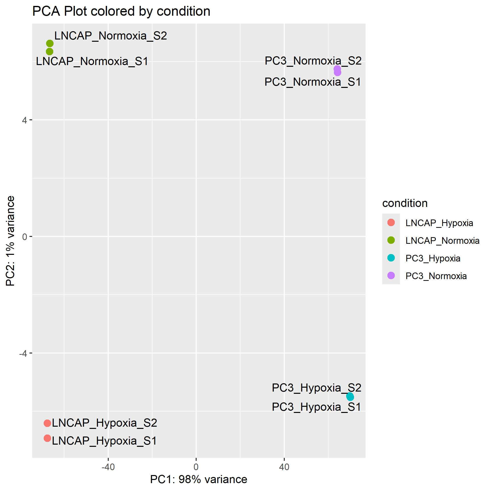

# Bulk RNA-Seq Analysis Project with GSEA

This repository contains a complete workflow for bulk RNA-seq analysis, including RNA-seq preprocessing, quality control, alignment, quantification, differential expression, and Gene Set Enrichment Analysis (GSEA) using R, Python, and standard bioinformatics tools.

*This pipeline was inspired by Erick Lu’s Bulk RNA-seq tutorial (2020). The current project adapts the workflow using HISAT2, featureCounts, and additional QC/filtering steps to create a reproducible RNA-seq analysis pipeline*

---

## Project Overview

The goal of this project is to analyze bulk RNA-seq data to identify differentially expressed genes (DEGs) and enriched biological pathways. The workflow includes:


---

## Folder Structure
```
bulk_rna_seq_prj/
├── data/               # Processed RNA-seq data and metadata
├── scripts/            # Analysis scripts (R, Python, Bash)
├── results/            # DE results, GSEA results, plots
├── README.txt          # Project documentation
└── environment.yml     # Dependencies for reproducibility
```
---
## Dataset Overview
*Source:* GEO accession GSE106305
*Publication:* Guo et al., Nature Communications 2019
*Cell Lines:* LNCaP (androgen-sensitive) and PC3 (androgen-independent)
*Conditions:* Normoxia (~21% O₂) vs. Hypoxia (~1-5% O₂)
*Replicates:* 2 biological replicates per condition
*Sequencing:* Illumina HiSeq 2000

### LNCAP (Empty Vector) Metadata

| Condition            | Replicate              | GEO Identifier | SRA Identifier (SRX) | SRA Runs                                       |
|----------------------|------------------------|----------------|----------------------|------------------------------------------------|
| Normoxia             | 1                      | GSM3145509     | SRX4096735           | SRR7179504  SRR7179505  SRR7179506  SRR7179507 |
| Normoxia             | 2                      | GSM3145510     | SRX4096736           | SRR7179508  SRR7179509  SRR7179510  SRR7179511 |
| Hypooxia             | 1                      | GSM3145513     | SRX4096739           | SRR7179520  SRR7179521  SRR7179522  SRR7179523 |
| Hypooxia             | 2                      | GSM3145514     | SRX4096740           | SRR7179524  SRR7179525  SRR7179526  SRR7179527 |

### PC3 (SiCtrl) Metadata

| Condition            | Replicate              | GEO Identifier | SRA Identifier (SRX) | SRA Runs                                       |
|----------------------|------------------------|----------------|----------------------|------------------------------------------------|
| Normoxia             | 1                      | GSM3145517     | SRX4096743           | SRR7179536                                     |
| Normoxia             | 2                      | GSM3145518     | SRX4096744           | SRR7179537                                     |
| Hypooxia             | 1                      | GSM3145521     | SRX4096747           | SRR7179540                                     |
| Hypooxia             | 2                      | GSM3145522     | SRX4096748           | SRR7179541                                     |

## Setup & Installation

**Programs required:** It is recommended that the user have Anaconda installed, through which all required programs can be installed. Assuming that Anaconda is available, all the required programs can be installed using the following:
```bash
#Install the required programs using anaconda
conda create -n preprocess python=3.7

conda install -n preprocess -c bioconda sra-toolkit fastqc multiqc trimmomatic hisat2 samtools subread
```


### Adding PATH to configuration file
```
nano ~/.bashrc
export PATH="/home/amina/sratoolkit/bin:$PATH"
source ~/.bashrc
```

The conda environment needs to be activated before running the pipeline using command:
```bash
conda activate preprocess
```
---


Download FASTQ files using SRA tools
------------------------------------
SRA-Toolkit: `prefetch`+`fasterq-dump`
- `--skip-technical`         : Skips technical reads (e.g., control reads or adapters)  
- `--read-filter pass`       : Filters out low-quality reads; keeps only those marked "pass"  
- `--clip`                   : Removes adapter sequences from reads  
- Automated python scripts [`scripts/fastq_download.py`](scripts/fastq_download.py)

Pre-alignment QC
----------------
*FASTQC + MULTIQC*

The raw sequence data is assessed for quality. 
<p align="center">


> The mean quality scores >30 (Phred score) and have high-confidence base calls

  

> The GC content is around ideal content and library is prepared well 

 

> Minimal adapter content (<5%) as adapters already removed by `fastq-dump --clip`. Adaptor sequences will also be excluded during alignment
</p>

Trimming(skipped)
------------------
*Trimmomatic*

- Mean quality scores >30 (Phred score)
- Read length is short (76 bp) — trimming would create short reads
Since the reads have short length and adapter sequences at minimal, this step is skipped as it may introduce, shorter reads, biasness and reduced statistical power.

<p align="center">
  
> Example of trimmed SRA file with reads at 26bp
</p>

Mapping reads using HISAT2
---------------------------
*HISAT2*

Among splice-aware aligners, STAR aligner provides more accurate and sensitive mapping
- HISAT2 is used here because it uses less memory and is significantly faster
- Automated processing: scripts/hisat_align.p

Sorting and Indexing BAM Files using SAMtool
--------------------------------------------
*SAMtool*

In order to achieve fast retrieval of alignments mapped to regions without having to process the entire set of alignments. 

Checking strandedness using FeatureCounts
-----------------------------------------
*FeatureCounts*

The library was prepared using TruSeq® Stranded mRNA Library Prep Kit and therefore reads are reverse stranded. In order to confirm, featureCounts were run on one sample under different standedness condition:

| Strand condition     | Assigned reads         | Unassigned_Ambiguity  | 
|----------------------|------------------------|-----------------------|
| Unstranded           | 35,704,156             |  4,056,493            |
| Forward-strand       | 2,546,478              |  71345                |
| Reverse-strand       | *37,370,684*           |  1,957,456            |          
This confirms that the read is reverse-stranded

Mapping Quality using Qualimap
-------------------------------------
*Qualimap*


Read summarisation using FeatureCounts
-------------------------------------
*FeatureCounts*

- 10-20× faster than HTSeq-count
- Multi-mapping handling by counting ambiguous reads fractionally

---
## Downstream analysis
Installing necessary packages
-----------------------------
```{r}
# install necessary libraries
install.packages("BiocManager")
BiocManager::install(version = "devel")
BiocManager::install("DESEQ2")
BiocManager::install("ReactomePA")

```

Loading count data and meta data
--------------------------------
The count matrix created is load and column are sample-wise
```{r}
#Loading counts after running featureCounts
raw_counts <- read.csv("data/GSE106305_counts_matrix.csv", header = TRUE, row.names = "Geneid", stringsAsFactors = FALSE)
raw_counts <- raw_counts[,sort(colnames(raw_counts))]
head(raw_counts)
colSums(raw_counts)
## LNCAP_Hypoxia_S1  LNCAP_Hypoxia_S2 LNCAP_Normoxia_S1 LNCAP_Normoxia_S2 
##         35704156          40621142          38248072          46410350 
##   PC3_Hypoxia_S1    PC3_Hypoxia_S2   PC3_Normoxia_S1   PC3_Normoxia_S2 
##         36884023          12629194          12917476          38077829
```
The metadata is created where the condition for each sample is stored
```{r}
#setting up metadata
condition <- c(rep("LNCAP_Hypoxia", 2), rep("LNCAP_Normoxia", 2), rep("PC3_Hypoxia", 2), rep("PC3_Normoxia", 2))
print(condition)

my_colData <- as.data.frame(condition)
rownames(my_colData) <- colnames(raw_counts)
head(my_colData)
write.csv(my_colData,file = "data/metadata.csv")
##                        condition
## LNCAP_Hypoxia_S1   LNCAP_Hypoxia
## LNCAP_Hypoxia_S2   LNCAP_Hypoxia
## LNCAP_Normoxia_S1 LNCAP_Normoxia
## LNCAP_Normoxia_S2 LNCAP_Normoxia
## PC3_Hypoxia_S1       PC3_Hypoxia
## PC3_Hypoxia_S2       PC3_Hypoxia
```

Creating DESeq Object
--------------------
```{r}
library(DESeq2)

dds <- DESeqDataSetFromMatrix(countData = raw_counts,
                              colData = my_colData,
                              design = ~condition)
dds
head(counts(dds))

## class: DESeqDataSet 
## dim: 78894 8 
## metadata(1): version
## assays(1): counts
## rownames(78894): ENSG00000000003 ENSG00000000005 ...
##   ENSG00000310576 ENSG00000310577
## rowData names(0):
## colnames(8): LNCAP_Hypoxia_S1 LNCAP_Hypoxia_S2 ... PC3_Normoxia_S1
##   PC3_Normoxia_S2
## colData names(1): condition

##                 LNCAP_Hypoxia_S1 LNCAP_Hypoxia_S2 LNCAP_Normoxia_S1
## ENSG00000000003              604              691               367
## ENSG00000000005                0                0                 0
## ENSG00000000419             1995             2302              2160
## ENSG00000000457              554              607               433
## ENSG00000000460              275              350               379
## ENSG00000000938                2                2                 2
##                 LNCAP_Normoxia_S2 PC3_Hypoxia_S1 PC3_Hypoxia_S2
## ENSG00000000003               380           1059            332
## ENSG00000000005                 0              0              0
## ENSG00000000419              2454           1974            693
## ENSG00000000457               518             88             26
## ENSG00000000460               349            390            155
## ENSG00000000938                 1              0              0
##                 PC3_Normoxia_S1 PC3_Normoxia_S2
## ENSG00000000003             352             971
## ENSG00000000005               0               0
## ENSG00000000419             747            1761
## ENSG00000000457              29              83
## ENSG00000000460             189             438
## ENSG00000000938               0               1
```

Genes with no gene expression across samples are checked. The table contains info in number of genes that have zero expression at different number of samples. 
```{r}
count_matrix <- counts(dds)
zero_counts_per_gene <- rowSums(count_matrix == 0)
count_matrix <- as.data.frame(count_matrix)
zero_summary <- table(zero_counts_per_gene)
print(zero_summary) #number of genes with diff. number of zero gene expression in samples

## zero_counts_per_gene
##     0     1     2     3     4     5     6     7 
## 19522  3391  2972  3281  5019  3858  4632  7435 
##     8 
## 28784 
```

Ensemble IDs to gene symbols using BioMart
------------------------------------------
Gene annotations (Ensemble ID, gene name, gene type) were downloaded via Ensembl BioMart <https://asia.ensembl.org/biomart/martview/03b16017eeb03b816d404a27eb7d9a55> and merged with the raw count matrix using Ensemble IDs.
```{r}
library(data.table)
library(dplyr)

annotation <- fread("data/GRCh38.p14_annotation.csv",stringsAsFactors = FALSE)
#renaming colnames
names(annotation)[names(annotation) %in% c("Gene stable ID", "Gene type", "Gene name")] <- c("Geneid", "Genebiotype", "Genesymbol")
annotation$Geneid <- sub("\\..*$","",annotation$Geneid)
head(annotation)
##             Geneid    Genebiotype Genesymbol
##             <char>         <char>     <char>
## 1: ENSG00000210049        Mt_tRNA      MT-TF
## 2: ENSG00000211459        Mt_rRNA    MT-RNR1
## 3: ENSG00000210077        Mt_tRNA      MT-TV
## 4: ENSG00000210082        Mt_rRNA    MT-RNR2
## 5: ENSG00000209082        Mt_tRNA     MT-TL1
## 6: ENSG00000198888 protein_coding     MT-ND1

#matrix to dataframe
raw_counts <-read.csv("data/GSE106305_counts_matrix.csv",
                     header = TRUE,
                     stringsAsFactors = FALSE)
raw_counts$Geneid <- sub("\\..*$","",raw_counts$Geneid)

annotated_data <- left_join(raw_counts,annotation, by = "Geneid")
head(annotated_data)
write.csv(annotated_data, file = "data/gene_annotated_raw_counts.csv")

```

Data filtering
--------------
Filtered the annotated count matrix to retain only protein-coding and immune-related gene types, reducing noise and focusing on biologically relevant signals
```{r}
genetypes_to_keep <- c("protein_coding", "IG_J_gene", "IG_V_gene", "IG_C_gene", "IG_D_gene", "TR_D_gene", "TR_C_gene", "TR_V_gene", "TR_J_gene")

filtered_counts<- annotated_data[annotated_data$Genebiotype %in% genetypes_to_keep,]
dim(filtered_counts)
filtered_counts$Geneid <- sub("\\..*$", "", filtered_counts$Geneid)

output_file <- "data/genetypes_counts_matrix.csv"
fwrite(filtered_counts, file = output_file, sep = ",", row.names = FALSE)

```

Low-expression genes (zero counts in ≥7 samples) were removed to improve statistical power(2 replicates for each condition)
```{r}
zero_counts1 <- rowSums(filtered_counts[, 4:11] == 0)
zero_summary2 <- table(zero_counts1)
print(zero_summary2)
#keep genes if less than 7 samples have zero expression (since 2 replicates)
keep_genes <- zero_counts1 < 7
filtered_counts_nozero <- filtered_counts[keep_genes, ]
cat("Number of genes after filtering (zeros in <7 samples):", nrow(filtered_counts_nozero), "\n")
## Number of genes after filtering (zeros in <7 samples): 20532

new_zero_counts <- rowSums(filtered_counts_nozero[, 4:11] == 0)
print(table(new_zero_counts)) #check if removed successfully 

output_file <- "data/genetype_nonzero_count_matrix.csv"
fwrite(filtered_counts_nozero, file = output_file, sep = ",",row.names= FALSE)

## new_zero_counts
##     0     1     2     3     4     5     6 
## 13601   951   877   744  1018   813  2528
```
> [!NOTE] 
> Genes with zero expression in all but one sample might be a outlier and is removed to reduce technical noise. 

DeseqDataSet is filtered for only the genes left in the filtered counts. A table for genes that were removed from desired genetypes was created
```{r}
dds_filtered <- dds[rownames(dds) %in% filtered_counts_nozero$Geneid, ]
cat("Dimensions of filtered DESeqDataSet:", dim(dds_filtered), "\n")
head(dds_filtered)

#list of zero gene expression > 7 sample under diff. gene types
removed_genes <- filtered_counts[!keep_genes, ]
cat("Biotype distribution of removed genes:\n")
print(table(removed_genes$Genebiotype)) 
```
The distribution of biotypes in filtered data. 
```{r}
library(ggplot2)

genetype_counts <-filtered_counts_nozero %>%
  count(Genebiotype) %>%
  mutate(Proportion = n/sum(n),
         Percentage = Proportion * 100) %>%
  rename(Biotype = Genebiotype)

#Barplot
p <- ggplot(genetype_counts, aes(x = reorder(Biotype, -Proportion), y = Proportion, fill = Biotype)) +
  geom_bar(stat = "identity") +
  labs(title = "Proportion of Genes by Biotype",
       x = "Gene Biotypes",
       y = "Proportion") +
  scale_y_continuous(labels = scales::percent_format(scale = 100)) +  # Show proportions as percentages
  theme_minimal() +
  theme(axis.text.x = element_text(angle = 45, hjust = 1),  # Rotate x-axis labels
        legend.position = "none") +  # Remove legend if biotypes are clear
  scale_fill_brewer(palette = "Set2")  # Use distinct colors
p
output_plot <- "results/genebiotype_proportions.png"
ggsave(output_plot, plot = p, width = 8, height = 6, dpi = 300)
```
<div style="text-align: center;">

</div>

> **Figure: Distribution of biotypes in filtered data:**
> The plots shows most of the dataset contains protein coding genes, with other biotpes such as immunogloblins and T-cell receptors in negligible proportions.

PCA plot before DESeq
---------------------
PCA clusters samples with similar gene expression. The variable stabilising transformation is deals with genes that are highly expressed in small datasets. The plot helps us to visualise variance structure and potential batch effect.
```{r}
#Stabilising variance across genes in sample
vsd <- vst(dds_filtered , blind = TRUE)

#plot PCA
plot_PCA = function (vsd.obj) {
  pcaData <- plotPCA(vsd.obj,  intgroup = c("condition"), returnData = T)
  percentVar <- round(100 * attr(pcaData, "percentVar"))
  ggplot(pcaData, aes(PC1, PC2, color=condition)) +
    geom_point(size=3) +
    labs(x = paste0("PC1: ",percentVar[1],"% variance"),
         y = paste0("PC2: ",percentVar[2],"% variance"),
         title = "PCA Plot colored by condition") +
    ggrepel::geom_text_repel(aes(label = name), color = "black")
}
png(filename = "results/pca_before.png", 
    width = 2000, height = 2000, res = 300)  # adjust width/height as needed
plot_PCA(vsd)
dev.off()
plot_PCA(vsd)
```
<div style="text-align: center;">

</div>

> **Figure: PCA before DESeq:**
> PCA shows the potential batch effect and the variance structure in the dataset. Here the clustering is seen to be based on biological difference along PC1, which acconts for the most difference.

DESeq - for differential expressed genes
----------------------------------------
```{r}
dds <- DESeq(dds_filtered)
## estimating size factors
## estimating dispersions
## gene-wise dispersion estimates
## mean-dispersion relationship
## final dispersion estimates
## fitting model and testing

dds
## class: DESeqDataSet 
## dim: 20532 8 
## metadata(1): version
## assays(4): counts mu H cooks
## rownames(20532): ENSG00000000003 ENSG00000000005 ...
##   ENSG00000310562 ENSG00000310576
## rowData names(30): baseMean baseVar ... deviance maxCooks
## colnames(8): LNCAP_Hypoxia_S1 LNCAP_Hypoxia_S2 ... PC3_Normoxia_S1
##   PC3_Normoxia_S2
## colData names(2): condition sizeFactor

normalized_counts <- counts(dds, normalized = T)
normalized_counts_df <- as.data.frame(normalized_counts)
write.csv(normalized_counts_df, file = "data/normalized_counts.csv", row.names = TRUE)
```

PCA plot after DESeq
--------------------
PCA to check how well the samples cluster by condition. This helps confirm that replicates behave consistently and that the major sources of variation are biologically meaningful.
```{r}

vsd <- vst(dds, blind = TRUE)  # blind=TRUE for exploratory PCA

plot_PCA = function (vsd.obj) {
  pcaData <- plotPCA(vsd.obj,  intgroup = c("condition"), returnData = T)
  percentVar <- round(100 * attr(pcaData, "percentVar"))
  ggplot(pcaData, aes(PC1, PC2, color=condition)) +
    geom_point(size=3) +
    labs(x = paste0("PC1: ",percentVar[1],"% variance"),
         y = paste0("PC2: ",percentVar[2],"% variance"),
         title = "PCA Plot colored by condition") +
    ggrepel::geom_text_repel(aes(label = name), color = "black")
}

png(filename = "results/pca_after.png", 
    width = 2000, height = 2000, res = 300)  # adjust width/height as needed
plot_PCA(vsd)
dev.off()
plot_PCA(vsd)
```
<div style="text-align: center;">

</div>

> **Figure: PCA after DESeq:**
> PCA shows the variance structure after removal of batch effect in the dataset. Here the clustering is seen to be similar to PCA plot before DESEQ which indicates minimal batch effect.

## Distance plot 
The plot calculates Euclidean distance based on the expression values of genes in order to check how similar the expression profiles are across conditions. This helps spot outliers and confirms that replicates cluster as expected.
```{r}
plotDists = function (vsd.obj) {
  sampleDists <- dist(t(assay(vsd.obj)))
  sampleDistMatrix <- as.matrix( sampleDists )
  rownames(sampleDistMatrix) <- paste( vsd.obj$condition )
  colors <- colorRampPalette( rev(RColorBrewer::brewer.pal(9, "Blues")) )(55)
  pheatmap::pheatmap(sampleDistMatrix,
                     clustering_distance_rows = sampleDists,
                     clustering_distance_cols = sampleDists,
                     col = colors,
                     fontsize_col = 4,
                     fontsize_row = 4,
                     fontsize_legend = 4,
                     fontsize = 4)
}
png(filename = "results/sampleheatmap1.png", width = 1000, height = 900, res = 300)  # adjust width/height as needed
plotDists(vsd)
dev.off()
plotDists(vsd)
```
<div style="text-align: center;">

</div>

> **Figure: Clustered Heatmap of Gene Expression:**
> The heatap show distinct clustering across samples based on cell lines and oxygen conditions. This indicates that experiment was successfull

Variable genes HeatMap
----------------------
The genes that drives the clustering of the samples can be visualised through Heatmap. Here top 40 variable genes are taken into account.
```{r}
variable_gene_heatmap <- function (vsd.obj, num_genes = 500, annotation, title = "") {
  brewer_palette <- "RdBu"
  ramp <- colorRampPalette( RColorBrewer::brewer.pal(11, brewer_palette))
  mr <- ramp(256)[256:1]
  stabilized_counts <- assay(vsd.obj)
  row_variances <- rowVars(stabilized_counts)
  top_variable_genes <- stabilized_counts[order(row_variances, decreasing=T)[1:num_genes],]
  top_variable_genes <- top_variable_genes - rowMeans(top_variable_genes, na.rm=T)
  gene_names <- annotation$Gene.name[match(rownames(top_variable_genes), annotation$Gene.stable.ID)]
  rownames(top_variable_genes) <- gene_names
  coldata <- as.data.frame(vsd.obj@colData)
  coldata$sizeFactor <- NULL
  pheatmap::pheatmap(top_variable_genes, color = mr, annotation_col = coldata, fontsize_col = 4, fontsize_row = 250/num_genes, border_color = NA, main = title)
}

png(filename = "results/variable_gene_heatmap.png", 
    width = 2000, height = 1500, res = 300)  # adjust width/height as needed
variable_gene_heatmap(vsd, num_genes = 40, annotation = annotation)
dev.off()
variable_gene_heatmap(vsd, num_genes = 40, annotation = annotation)

```
<div style="text-align: center;">

</div>

> **Figure: Clustered Heatmap of Gene Expression:**
> The heatap visualizes gene expression levels across samples under hypoxia and normoxia in LNCaP and PC3 cell lines. The blue-to-red gradient reflects low to high expression, respectively. Hierarchical clustering reveals  sample clusters based on variability in gene expressions, highlighting transcriptional differences due to both oxygen condition and cell type.

Density plots- Raw vs VST-transformed data
------------------------------------------
Plotted density curves for raw and VST-transformed counts across all samples to check how well variance was stabilized. This helps confirm that expression distributions are more comparable post-transformation using VST.
```{r}
raw_counts <- assay(dds)
vst_counts <- assay(vsd)

png("results/density_plots_raw_vst.png",
    width = 4000, height = 4000, res = 300)  # Adjust width, height (pixels), and resolution (dpi)

par(mfrow = c(4, 4), mar = c(3, 3, 2, 1))  # mar adjusts margins (bottom, left, top, right)

for (i in 1:8) {
  # Raw counts density
  plot(density(raw_counts[, i]),
       main = paste("Raw - Sample", colnames(raw_counts)[i]),
       xlab = "Expression",
       col = "red",
       lwd = 2,
       ylim = c(0, max(sapply(1:8, function(j) max(density(raw_counts[, j])$y, na.rm = TRUE))))  # Uniform y-axis
       )
  
  # VST counts density (next panel)
  plot(density(vst_counts[, i]),
       main = paste("VST - Sample", colnames(vst_counts)[i]),
       xlab = "Expression",
       col = "blue",
       lwd = 2,
       ylim = c(0, max(sapply(1:8, function(j) max(density(vst_counts[, j])$y, na.rm = TRUE))))  # Uniform y-axis
       )
}
dev.off()
```
<div style="text-align: center;">

</div>

> **Figure: Density plots of raw vs. VST-transformed expression values:**
> The plots indicate that raw expression values have a highly skewed distribution, with particularly high variance in low-count regions. This variability makes raw data difficult to compare across samples. After applying Variance Stabilizing Transformation (VST), the distributions become more symmetric and bell-shaped, with variance stabilized across the range of expression values. This transformation enhances comparability between samples and prepares the data for downstream statistical analysis.

Gene expression profile - IGFBP1
--------------------------------
```{r}
library(tibble)
plot_counts <- function (dds, gene, normalization = "DESeq2"){
  
  if (normalization == "cpm") {
    normalized_data <- cpm(counts(dds, normalized = F)) 
  } else if (normalization == "DESeq2")
    normalized_data <- counts(dds, normalized = T) 
  condition <- dds@colData$condition
  if (is.numeric(gene)) { 
    if (gene%%1==0 )
      ensembl_id <- rownames(normalized_data)[gene]
    else
      stop("Invalid index supplied.")
  } else if (gene %in% annotation$Genesymbol){ 
    ensembl_id <- annotation$Geneid[which(annotation$Genesymbol == gene)]
  } else if (gene %in% annotation$Geneid){
    ensembl_id <- gene
  } else {
    stop("Gene not found. Check spelling.")
  }
  
  expression <- normalized_data[ensembl_id,]
  gene_name <- annotation$Genesymbol[which(annotation$Geneid == ensembl_id)]
  gene_tib <- tibble(condition = condition, expression = expression)
  ggplot(gene_tib, aes(x = condition, y = expression))+
    geom_boxplot(outlier.size = NULL)+
    geom_point()+
    labs (title = paste0("Expression of ", gene_name, " - ", ensembl_id), x = "group", y = paste0("Normalized expression (", normalization , ")"))+
    theme(axis.text.x = element_text(size = 11), axis.text.y = element_text(size = 11))
}

gene_plot<-plot_counts(dds, "IGFBP1")
ggsave(filename ="results/IGFBP1_cond.png" , plot = gene_plot,bg = "white", width = 8, height = 6, dpi = 300)
```
<div style="text-align: center;">

</div>

> **Figure: Normalized expression of IGFBP1 across conditions:**
> This boxplot shows the DESeq2-normalized expression of IGFBP1 (ENSG00000146678) across sample conditions. Higher expression in seen in PC3 cell lines when compared to low levels in LNCAP cell. Among PC3 cells,  higher levels of expression is seem in low oxygen condition. These patterns suggest that IGFBP1 is upregulated under hypoxia in PC3 cells, highlighting a potential cell line–specific response to oxygen stress.

---

# LNCAP - Hypoxia VS Normoxia

The LNCAP sampled were filtered from dataset, to compare hypoxia vs normoxia. Normoxia is set as reference and DESeq2 was ran. The genes are ordered based on adjusted p-values
```{r}
# Filter the DESeq2 dataset (dds) to keep only LNCAP samples
dds_lncap <- dds[, grepl("LNCAP", colnames(dds))]
dds_lncap
dds_lncap$condition <- droplevels(dds_lncap$condition)#removing unrelated levels
#setting LNCAP Normoxia as reference
dds_lncap$condition <- relevel(dds_lncap$condition, ref = "LNCAP_Normoxia")
dds_lncap <- DESeq(dds_lncap)

# Extract differential expression results for contrast: LNCAP_Hypoxia vs LNCAP_Normoxia
res_lncap <- results(dds_lncap, contrast = c("condition", "LNCAP_Hypoxia", "LNCAP_Normoxia"))
res_lncap
summary(res_lncap)

reslncapOrdered <- res_lncap[order(res_lncap$padj), ] #order with padj values
sum(reslncapOrdered$padj < 0.05, na.rm = TRUE)
head(reslncapOrdered)
summary(reslncapOrdered)
write.csv(as.data.frame(reslncapOrdered), file = "data/DEGs_lncap.csv")

```

```{r}
plotMA(reslncapOrdered,ylim=c(-2,2))
```
Volcano plot - gene regulation
-------------------------------
The volcano plot shows the gene regulation under hypoxia condition in LNCAP cell lines. Genes were categorized as significant with p-adj < 0.05, and upregulated or downregulated based on fold change. 
```{r}
#install.packages("ggplot2")
library(ggplot2)
res_df <- as.data.frame(reslncapOrdered)
res_df <- na.omit(res_df)
res_df$gene <- rownames(res_df) #gene names added as column

#Gene regulation categorised
res_df$regulation <- "Not Significant" #defaulted 
res_df$regulation[res_df$padj < 0.05 & res_df$log2FoldChange > 1] <- "Upregulated"
res_df$regulation[res_df$padj < 0.05 & res_df$log2FoldChange < -1] <- "Downregulated"

#Volcano plot
qp <- ggplot(res_df, aes(x = log2FoldChange, 
                         y = -log10(padj), 
                         color = regulation)) + #categorise based on regulation
  geom_point(alpha = 0.6) +
  scale_color_manual(values = c("Upregulated" = "#FEA405", 
                                "Downregulated" = "purple", 
                                "Not Significant" = "gray")) +
  #Threshold line at padj = 0.05
  geom_hline(yintercept = -log10(0.05), linetype = "dashed", color = "black") +
  #placement of text
  annotate("text", x = min(res_df$log2FoldChange), y = -log2(0.05) + 0.5,
           label = "padj = 0.05", hjust = 0, size = 3) +
  theme_minimal() +
  #labels
  labs(title = "Volcano Plot", 
       x = "Log2 Fold Change", 
       y = "-Log10 Adjusted P-Value") +
  theme(plot.title = element_text(hjust = 0.5))

v_plot <- "results/vp_lncap.png"
ggsave(v_plot, plot = qp,bg = "white", width = 8, height = 6, dpi = 300)
qp
```
<div style="text-align: center;">

</div>

> **Figure:  Volcano plot of differential gene expression in LNCAP:** 
> The volcano plot displays the results of differential expression analysis, with log₂ fold change on the x-axis and –log₁₀ adjusted p-value on the y-axis. Genes with p-adj < 0.05, are grouped as upregulated (log₂ fold change > 1)are shown in orange, downregulated (log₂ fold change < 1) in purple, and non-significant (p-adj > 0.05) in grey. Under the oxygen stress condition, more genes are upregulated than downregulated, indicating increased transcriptional expression.

Gene Set Enrichment Analysis (GSEA)
-----------------------------------
GSEA was performed using ReactomePA on DESeq2-derived log2 fold changes from LNCaP cells under hypoxia versus normoxia. Ensembl IDs were mapped to Entrez IDs, and genes were ranked by fold change. Enriched pathways were identified based on normalized enrichment scores (NES) and adjusted p-values.
```{r}
res_lncap <- read.csv("data/DEGs_lncap.csv", row.names = 1)
head(res_lncap)

library(clusterProfiler)
library(org.Hs.eg.db)
library(dplyr)
library(stats)

#convert ENSEMBL ids to entrez ids for Reactome
ncbi_list <- clusterProfiler::bitr(
  geneID = rownames(res_lncap),        # use Ensembl IDs from row names
  fromType = "ENSEMBL",          
  toType = "ENTREZID", 
  OrgDb = org.Hs.eg.db
)
#Column with Esemble ids
res_lncap$ENSEMBL <- rownames(res_lncap)
head(res_lncap)

#Merge ncbi_list with valid entrez id and remove duplicates 
res_mapped <- res_lncap %>%
  left_join(ncbi_list, by = "ENSEMBL") %>%
  filter(!is.na(ENTREZID)) %>%
  distinct(ENTREZID, .keep_all = TRUE)

#Genes ranked based on log2FoldChange
ngenes <- res_mapped$log2FoldChange
names(ngenes) <- res_mapped$ENTREZID
ngenes <- sort(ngenes, decreasing = TRUE)

#GSEA
library(ReactomePA)
enp_gsea <- gsePathway(
  ngenes,
  organism = "human",
  #pvalueCutoff = 0.05,
  #pAdjustMethod = "BH",
  #minGSSize = 10,  
  #maxGSSize = 500, 
  verbose = FALSE
)
head(enp_gsea@result)
```
GSEA results are sorted by adjusted p-value and normalized enrichment score (NES) to highlight the most responsive pathways. Here entire expression profile (including non-significant genes) is considered
```{r}
pathways <- enp_gsea@result 
# Sort pathways by adjusted p-value (FDR) to prioritize statistically significant ones
pathways <- pathways[order(pathways$p.adjust), ]

#Reorder by absolute NES to highlight strongest up/down regulated pathways
top_pathways <- pathways[order(abs(pathways$NES), decreasing = TRUE), ]  # Sort by NES

library(dplyr)
library(forcats)

top20 <- top_pathways[1:20, ] %>%
  mutate(Description = fct_reorder(Description, NES)) # Reorder factor for y-axis based on NES

write.csv(top20, "data/top20_pathways.csv", row.names = FALSE)

```

## Pathway enrichment based on overall expression profile
Plotted the top Reactome pathways from GSEA using NES, FDR, and gene set size to show which biological processes are most enriched. The pathways maybe downregulated or upregulated
```{r}
library(ggplot2)

enrich_overall <- ggplot(top20, aes(x = NES,                 
                        y = Description,
                        color = p.adjust,
                        size = setSize)) +
  geom_point(alpha = 0.9) +
  scale_color_gradient(low = "#0072B2", high = "#D55E00", name = "FDR (p.adjust)") +
  scale_size(range = c(3, 10), name = "Gene Set Size") +
  labs(
    title = "Top 10 Enriched Pathways",
    subtitle = "Gene Set Enrichment Analysis (GSEA)",
    x = "Normalized Enrichment Score (NES)",
    y = NULL,
    caption = "Data source: clusterProfiler::gsePathway"
  ) +
  theme_minimal(base_size = 14) +
  theme(
    axis.text.y = element_text(size = 12),
    axis.text.x = element_text(size = 12),
    plot.title = element_text(face = "bold", size = 16),
    plot.subtitle = element_text(size = 13),
    legend.position = "right"
  )
ggsave("results/enrichment_overall_lncap.png", 
       plot = enrich_overall,
       bg = "white",
       width = 15, height = 6, dpi = 300)


```
<div style="text-align: center;">

</div>

> **Figure: Top enriched pathways in LNCAP:**
> The plot shows top enriched pathway based on normalised enrichment scores(NES). The NES values are negative, indicating significant downregulation in these pathway during low oxygen stress. The dot size reflects number of genes involved and dot color indicates statistical significance based on FDR-adjusted p-vlaue.The supressed pathway include transalation, ribosomal RNA processing and protein synthesis-related pathway along with nonsense-mediated deacy and selenometabolism indicating reduction in energy-intensive protein production and RNA turnover. 

## Pathway enrichment by significant DEGs
Pathway enrichment using ReactomePA to see which biological processes are impacted by the significant and differentially expressed genes. The gene-ratio is based on the number of DEGs in total number of genes involved while the dot size indicate the absolute number of DEGs involved
```{r}
library(ReactomePA)
# Filter DEGs: padj < 0.1 and |log2FC| > 0.5, then extract ENTREZ IDs
sig_genes <- res_mapped %>%
  filter(padj < 0.1, abs(log2FoldChange) > 0.5) %>%
  pull(ENTREZID)
# Run Reactome pathway enrichment for significant genes
enr <- enrichPathway(gene = sig_genes, organism = "human", pvalueCutoff = 0.1)

reactome_plot <- dotplot(enr, showCategory=20)
ggsave("results/react_sig_genes_lncap.png", 
       plot = reactome_plot, 
       bg = "white",
       width = 8, height = 10, dpi = 300)

```
<div style="text-align: center;">

</div>

> **Figure: Pathways enriched by significant genes in LNCAP:**
> The dot plot shows enriched pathways ranked by significant differentially expressed genes. The gene-ratio is based on the percentage on DEGs involved in pathway. The dot size reflects number of genes involved and dot color indicates statistical significance based on FDR-adjusted p-vlaue. Enriched pathways include metabolism of amino acids, transalation, respiratory electron transport and stress responses

## GSEA of Hallmark Programs 
in order to understand broad biological responses in LNCAP cells under hypoxia

Ranked Gene List for GSEA using log2fold change
```{r}
head(res_lncap)
# Map Ensembl IDs to gene symbols using org.Hs.eg.db
symbol_map <- bitr(res_lncap$ENSEMBL, fromType = "ENSEMBL", toType = "SYMBOL", OrgDb = org.Hs.eg.db)

# Merge and filter
rank_df <- merge(res_lncap, symbol_map, by.x = "ENSEMBL", by.y = "ENSEMBL")
rank_df <- rank_df[, c("SYMBOL", "log2FoldChange")]
colnames(rank_df) <- c("Gene.name", "log2FoldChange")

# Save as .rnk
head(rank_df)
write.table(rank_df, file = "data/lncaprank.rnk", sep = "\t", quote = FALSE, row.names = FALSE, col.names = TRUE)
```


Downloaded Hallmark gene sets from MSigDB <https://www.gsea-msigdb.org/gsea/msigdb/human/collections.jsp#H> and prepped the ranked list for GSEA
```{r}
library(fgsea)
# Load Hallmark gene sets from GMT file
hallmark_pathway <- gmtPathways("data/h.all.v2025.1.Hs.symbols.gmt")
head(names(hallmark_pathway))
head(hallmark_pathway$HALLMARK_HYPOXIA, 20)

lncap_ranked_list <- read.table("data/lncaprank.rnk", header = T, stringsAsFactors = F)
head(lncap_ranked_list)

#Clean and prepare ranked list for fgsea
prepare_ranked_list <- function(ranked_list) { 
  if( sum(duplicated(ranked_list$Gene.name)) > 0) {
    ranked_list <- aggregate(.~Gene.name, FUN = mean, data = ranked_list)
    ranked_list <- ranked_list[order(ranked_list$log2FoldChange, decreasing = T),]
  }
  # Remove NA values
  ranked_list <- na.omit(ranked_list)
  #Convert data frame to name vector 
  ranked_list <- tibble::deframe(ranked_list)
  ranked_list
}

lncap_ranked_list <- prepare_ranked_list(lncap_ranked_list)
head(lncap_ranked_list)
```

### Validate Ranked Gene list
```{r}
prepare_ranked_list <- function(ranked_list) {
  #check if nammed numeric vector
  if (is.vector(ranked_list) && !is.list(ranked_list)) {
    return(ranked_list)  # Return as-is if already processed
  }
  #check for requiered columns
  if (!is.data.frame(ranked_list)) {
    stop("Input 'ranked_list' must be a data frame with 'Gene.name' and 'log2FoldChange' columns.")
  }
  #Check duplicate genes and avg. fold change
  if (sum(duplicated(ranked_list$Gene.name)) > 0) {
    ranked_list <- aggregate(. ~ Gene.name, data = ranked_list, FUN = mean)
    ranked_list <- ranked_list[order(ranked_list$log2FoldChange, decreasing = TRUE), ]
  }

  ranked_list <- na.omit(ranked_list)
  ranked_list <- tibble::deframe(ranked_list[, c("Gene.name", "log2FoldChange")])

  return(ranked_list)
}
#check if rank list exists
if (!exists("data/lncap_ranked_list")) {
   #Convert res_lncap to a ranked list data
  symbol_map <- bitr(res_lncap$ENSEMBL, fromType = "ENSEMBL", toType = "SYMBOL", OrgDb = org.Hs.eg.db)
  rank_df <- merge(res_lncap, symbol_map, by.x = "ENSEMBL", by.y = "ENSEMBL")
  rank_df <- rank_df[, c("SYMBOL", "log2FoldChange")]
  colnames(rank_df) <- c("Gene.name", "log2FoldChange")
  lncap_ranked_list <- rank_df
}


lncap_ranked_list <- prepare_ranked_list(lncap_ranked_list)
print(head(lncap_ranked_list))
```

Run GSEA using Hallmark gene sets and ranked LNCaP gene list
```{r}
fgsea_results <- fgsea(pathways = hallmark_pathway,
                  stats = lncap_ranked_list,
                  minSize = 15,
                  maxSize = 500,
                  nperm= 1000)
#Sort by decreasing NES
fgsea_results_ordered <- fgsea_results[order(-NES)]
head(fgsea_results_ordered[, .(pathway, padj, NES)])
```

## Hallmark GSEA – LNCaP Hypoxia Response
The plot to show which Hallmark programs are enriched in LNCaP cells under hypoxia. Pathways are sorted by NES, and bars are blue colored by significance (padj < 0.05).

```{r}
#install.packages("waterfalls")
library(waterfalls)

waterfall_plot <- function (fsgea_results, graph_title) {
  fgsea_results %>% 
    mutate(short_name = str_split_fixed(pathway, "_",2)[,2])%>% # removes 'HALLMARK_' from the pathway title 
    ggplot( aes(reorder(short_name,NES), NES)) +
      geom_bar(stat= "identity", aes(fill = padj<0.05))+
      coord_flip()+
      labs(x = "Hallmark Pathway", y = "Normalized Enrichment Score", title = graph_title)+
      theme(axis.text.y = element_text(size = 7), 
            plot.title = element_text(hjust = 1))
}
library(stringr)
hallmark_enrich<- waterfall_plot(fgsea_results, "Hallmark pathways altered by hypoxia in LNCaP cells")
ggsave("results/hallmark_enrich_lncap.png", 
       plot = hallmark_enrich, 
       bg = "white",
       width = 10, height = 10, dpi = 300)
```
<div style="text-align: center;">

</div>

> **Figure: Hallmark pathway enrichment analysis in LNCaP cells under hypoxia:**
Bar plot of normalized enrichment scores (NES) showing pathways significantly altered under hypoxia. The blue bars indiactes the significantly enriched pathway with padj-values<0.05  Pathways such as glycolysis, angiogenesis, EMT, and TGF-beta signaling were significantly upregulated, support tumor survival and progression in low-oxygen environments. In contrast, oxidative phosphorylation, interferon responses, and inflammatory pathways were significantly downregulated, indicating suppression of anti-tumor immune activity and a metabolic shift away from mitochondrial respiration.
---

# PC3 - Hypoxia VS Normoxia

The variabilty of genes expression across condition for PC3 cell line is checked
From the dds, only LNCAP cell lines are filtered 
```{r}
# Filter the DESeq2 dataset (dds) to keep only LNCAP samples
dds_pc3 <- dds[, grepl("PC3", colnames(dds))]
dds_pc3
dds_pc3$condition <- droplevels(dds_pc3$condition)#removing unrelated levels
#setting PC3 Normoxia as reference
dds_pc3$condition <- relevel(dds_pc3$condition, ref = "PC3_Normoxia")
dds_pc3 <- DESeq(dds_pc3)

# Extract differential expression results for contrast: LNCAP_Hypoxia vs LNCAP_Normoxia
res_pc3 <- results(dds_pc3, contrast = c("condition", "PC3_Hypoxia", "PC3_Normoxia"))
res_pc3
summary(res_pc3)

respc3Ordered <- res_pc3[order(res_pc3$padj), ] #order with padj values
sum(respc3Ordered$padj < 0.05, na.rm = TRUE)
head(respc3Ordered)
summary(respc3Ordered)
write.csv(as.data.frame(respc3Ordered), file = "data/DEGs_pc3.csv")

```


```{r}
plotMA(respc3Ordered)
```

Volcano plot - gene regulation
------------------------------
```{r}
#install.packages("ggplot2")
library(ggplot2)
res_df <- as.data.frame(respc3Ordered)
res_df <- na.omit(res_df)
res_df$gene <- rownames(res_df) #gene names added as column

#Gene regulation categorised
res_df$regulation <- "Not Significant" #defaulted 
res_df$regulation[res_df$padj < 0.05 & res_df$log2FoldChange > 1] <- "Upregulated"
res_df$regulation[res_df$padj < 0.05 & res_df$log2FoldChange < -1] <- "Downregulated"

#Volcano plot
qp <- ggplot(res_df, aes(x = log2FoldChange, 
                         y = -log10(padj), 
                         color = regulation)) + #categorise based on regulation
  geom_point(alpha = 0.6) +
  scale_color_manual(values = c("Upregulated" = "#FEA405", 
                                "Downregulated" = "purple", 
                                "Not Significant" = "gray")) +
  #Threshold line at padj = 0.05
  geom_hline(yintercept = -log10(0.05), linetype = "dashed", color = "black") +
  #placement of text
  annotate("text", x = min(res_df$log2FoldChange), y = -log2(0.05) + 0.5,
           label = "padj = 0.05", hjust = 0, size = 3) +
  theme_minimal() +
  #labels
  labs(title = "Volcano Plot", 
       x = "Log2 Fold Change", 
       y = "-Log10 Adjusted P-Value") +
  theme(plot.title = element_text(hjust = 0.5))

v_plot <- "results/vp_pc3.png"
ggsave(v_plot, plot = qp,bg = "white", width = 8, height = 6, dpi = 300)
qp
```
<div style="text-align: center;">

</div>

Gene Set Enrichment Analysis (GSEA)
-----------------------------------
```{r}
res_pc3 <- read.csv("data/DEGs_pc3.csv", row.names = 1)
head(res_pc3)

library(clusterProfiler)
library(org.Hs.eg.db)
library(dplyr)
library(stats)

#convert ENSEMBL ids to entrez ids for Reactome
ncbi_list <- clusterProfiler::bitr(
  geneID = rownames(res_pc3),        # use Ensembl IDs from row names
  fromType = "ENSEMBL",          
  toType = "ENTREZID", 
  OrgDb = org.Hs.eg.db
)
#Column with Esemble ids
res_pc3$ENSEMBL <- rownames(res_pc3)
head(res_pc3)

#Merge ncbi_list with valid entrez id and remove duplicates 
res_mapped <- res_pc3 %>%
  left_join(ncbi_list, by = "ENSEMBL") %>%
  filter(!is.na(ENTREZID)) %>%
  distinct(ENTREZID, .keep_all = TRUE)

#Genes ranked based on log2FoldChange
ngenes <- res_mapped$log2FoldChange
names(ngenes) <- res_mapped$ENTREZID
ngenes <- sort(ngenes, decreasing = TRUE)

#GSEA
library(ReactomePA)
enp_gsea <- gsePathway(
  ngenes,
  organism = "human",
  #pvalueCutoff = 0.05,
  #pAdjustMethod = "BH",
  #minGSSize = 10,  
  #maxGSSize = 500, 
  verbose = FALSE
)
head(enp_gsea@result)
```

## Pathway enrichment based on overall expression profile
```{r}
pathways <- enp_gsea@result
pathways <- pathways[order(pathways$p.adjust), ]# Sort by FDR (adjusted p-value)
top_pathways <- pathways[order(abs(pathways$NES), decreasing = TRUE), ]  # Sort by NES

library(dplyr)
library(forcats)

top20 <- top_pathways[1:20, ] %>%
  mutate(Description = fct_reorder(Description, NES))  # Reorder factor for y-axis

write.csv(top20, "data/top20_pathways_pc3.csv", row.names = FALSE)

```

```{r}

library(ggplot2)

enrich_overall <- ggplot(top20, aes(x = NES,
                        y = Description,
                        color = p.adjust,
                        size = setSize)) +
  geom_point(alpha = 0.9) +
  scale_color_gradient(low = "#0072B2", high = "#D55E00", name = "FDR (p.adjust)") +
  scale_size(range = c(3, 10), name = "Gene Set Size") +
  labs(
    title = "Top 10 Enriched Pathways",
    subtitle = "Gene Set Enrichment Analysis (GSEA)",
    x = "Normalized Enrichment Score (NES)",
    y = NULL,
    caption = "Data source: clusterProfiler::gsePathway"
  ) +
  theme_minimal(base_size = 14) +
  theme(
    axis.text.y = element_text(size = 12),
    axis.text.x = element_text(size = 12),
    plot.title = element_text(face = "bold", size = 16),
    plot.subtitle = element_text(size = 13),
    legend.position = "right"
  )

ggsave("results/enrichment_overall_pc3.png", 
       plot = enrich_overall,
       bg = "white",
       width = 15, height = 6, dpi = 300)

```
<div style="text-align: center;">

</div>

## Pathway enrichment by significant DEGs
```{r}
library(ReactomePA)
sig_genes <- res_mapped %>%
  filter(padj < 0.1, abs(log2FoldChange) > 0.5) %>%
  pull(ENTREZID)
enr <- enrichPathway(gene = sig_genes, organism = "human", pvalueCutoff = 0.1)
reactome_plot<- dotplot(enr, showCategory=20)
ggsave("results/react_sig_genes_pc3.png", 
       plot = reactome_plot, 
       bg = "white",
       width = 8, height = 10, dpi = 300)
```
<div style="text-align: center;">

</div>

## GSEA of Hallmark Programs
```{r}
head(res_pc3)
symbol_map <- bitr(res_pc3$ENSEMBL, fromType = "ENSEMBL", toType = "SYMBOL", OrgDb = org.Hs.eg.db)

# Merge and filter
rank_df_pc3 <- merge(res_pc3, symbol_map, by.x = "ENSEMBL", by.y = "ENSEMBL")
rank_df_pc3 <- rank_df_pc3[, c("SYMBOL", "log2FoldChange")]
colnames(rank_df_pc3) <- c("Gene.name", "log2FoldChange")

# Save as .rnk
head(rank_df_pc3)
write.table(rank_df_pc3, file = "data/pc3rank.rnk", sep = "\t", quote = FALSE, row.names = FALSE, col.names = TRUE)
```


```{r}
library(fgsea)

hallmark_pathway <- gmtPathways("data/h.all.v2025.1.Hs.symbols.gmt")
head(names(hallmark_pathway))
head(hallmark_pathway$HALLMARK_HYPOXIA, 20)

pc3_ranked_list <- read.table("data/pc3rank.rnk", header = T, stringsAsFactors = F)
head(pc3_ranked_list)

prepare_ranked_list <- function(ranked_list) { 
  if( sum(duplicated(ranked_list$Gene.name)) > 0) {
    ranked_list <- aggregate(.~Gene.name, FUN = mean, data = ranked_list)
    ranked_list <- ranked_list[order(ranked_list$log2FoldChange, decreasing = T),]
  }
  ranked_list <- na.omit(ranked_list)
  ranked_list <- tibble::deframe(ranked_list)
  ranked_list
}

pc3_ranked_list <- prepare_ranked_list(pc3_ranked_list)
head(pc3_ranked_list)
```

### Validate Ranked Gene list
```{r}
prepare_ranked_list <- function(ranked_list) {
  if (is.vector(ranked_list) && !is.list(ranked_list)) {
    return(ranked_list)  # Return as-is if already processed
  }

  if (!is.data.frame(ranked_list)) {
    stop("Input 'ranked_list' must be a data frame with 'Gene.name' and 'log2FoldChange' columns.")
  }
  if (sum(duplicated(ranked_list$Gene.name)) > 0) {
    ranked_list <- aggregate(. ~ Gene.name, data = ranked_list, FUN = mean)
    ranked_list <- ranked_list[order(ranked_list$log2FoldChange, decreasing = TRUE), ]
  }

  ranked_list <- na.omit(ranked_list)
  ranked_list <- tibble::deframe(ranked_list[, c("Gene.name", "log2FoldChange")])

  return(ranked_list)
}

if (!exists("pc3_ranked_list")) {
  symbol_map <- bitr(res_pc3$ENSEMBL, fromType = "ENSEMBL", toType = "SYMBOL", OrgDb = org.Hs.eg.db)
  rank_df_pc3 <- merge(res_pc3, symbol_map, by.x = "ENSEMBL", by.y = "ENSEMBL")
  rank_df_pc3 <- rank_df_pc3[, c("SYMBOL", "log2FoldChange")]
  colnames(rank_df_pc3) <- c("Gene.name", "log2FoldChange")
  pc3_ranked_list <- rank_df_pc3
  # Example: Convert res_lncap to a ranked list data frame
  }

pc3_ranked_list <- prepare_ranked_list(pc3_ranked_list)
print(head(pc3_ranked_list))
```

Run GSEA using Hallmark gene sets and ranked PC3 gene list
```{r}
fgsea_results <- fgsea(pathways = hallmark_pathway,
                  stats = pc3_ranked_list,
                  minSize = 15,
                  maxSize = 500,
                  nperm= 1000)
fgsea_results_ordered <- fgsea_results[order(-NES)]
head(fgsea_results_ordered[, .(pathway, padj, NES)])

```

## Hallmark GSEA – PC3 Hypoxia Response
```{r}
waterfall_plot <- function (fsgea_results, graph_title) {
  fgsea_results %>% 
    mutate(short_name = str_split_fixed(pathway, "_",2)[,2])%>% # removes 'HALLMARK_' from the pathway title 
    ggplot( aes(reorder(short_name,NES), NES)) +
      geom_bar(stat= "identity", aes(fill = padj<0.05))+
      coord_flip()+
      labs(x = "Hallmark Pathway", y = "Normalized Enrichment Score", title = graph_title)+
      theme(axis.text.y = element_text(size = 7), 
            plot.title = element_text(hjust = 1))
}
library(stringr)
hallmark_enrich <- waterfall_plot(fgsea_results, "Hallmark pathways altered by hypoxia in PC3 cells")
ggsave("results/hallmark_enrich_pc3.png", 
       plot = hallmark_enrich, 
       bg = "white",
       width = 10, height = 10, dpi = 300)
```
<div style="text-align: center;">

</div>

---

### Session info
```{r}
sink("session_info.txt")
sessionInfo()
sink()
```

*THE END*


[^1]:https://bioconductor.org/packages/devel/bioc/vignettes/Rsubread/inst/doc/SubreadUsersGuide.pdf             