# Bulk RNA-Seq Analysis Project with GSEA

This repository contains a complete workflow for bulk RNA-seq analysis, including RNA-seq preprocessing, quality control, alignment, quantification, differential expression, and Gene Set Enrichment Analysis (GSEA) using R, Python, and standard bioinformatics tools.

*This pipeline was inspired by Erick Lu’s Bulk RNA-seq tutorial (2020). The current project adapts the workflow using HISAT2, featureCounts, and additional QC/filtering steps to create a reproducible RNA-seq analysis pipeline*

---

## Project Overview

The goal of this project is to analyze bulk RNA-seq data to identify differentially expressed genes (DEGs) and enriched biological pathways. The workflow includes:

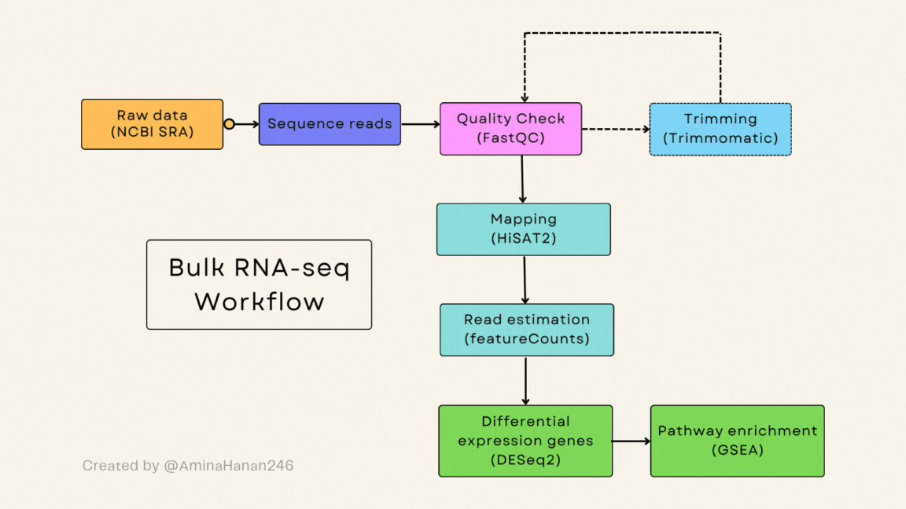

---

## Folder Structure
```
bulk_rna_seq_prj/
├── data/               # Processed RNA-seq data and metadata
├── scripts/            # Analysis scripts (R, Python, Bash)
├── results/            # DE results, GSEA results, plots
├── README.txt          # Project documentation
└── environment.yml     # Dependencies for reproducibility
```
---
## Dataset Overview
*Source:* GEO accession GSE106305
*Publication:* Guo et al., Nature Communications 2019
*Cell Lines:* LNCaP (androgen-sensitive) and PC3 (androgen-independent)
*Conditions:* Normoxia (~21% O₂) vs. Hypoxia (~1-5% O₂)
*Replicates:* 2 biological replicates per condition
*Sequencing:* Illumina HiSeq 2000

### LNCAP (Empty Vector) Metadata

| Condition            | Replicate              | GEO Identifier | SRA Identifier (SRX) | SRA Runs                                       |
|----------------------|------------------------|----------------|----------------------|------------------------------------------------|
| Normoxia             | 1                      | GSM3145509     | SRX4096735           | SRR7179504  SRR7179505  SRR7179506  SRR7179507 |
| Normoxia             | 2                      | GSM3145510     | SRX4096736           | SRR7179508  SRR7179509  SRR7179510  SRR7179511 |
| Hypooxia             | 1                      | GSM3145513     | SRX4096739           | SRR7179520  SRR7179521  SRR7179522  SRR7179523 |
| Hypooxia             | 2                      | GSM3145514     | SRX4096740           | SRR7179524  SRR7179525  SRR7179526  SRR7179527 |

### PC3 (SiCtrl) Metadata

| Condition            | Replicate              | GEO Identifier | SRA Identifier (SRX) | SRA Runs                                       |
|----------------------|------------------------|----------------|----------------------|------------------------------------------------|
| Normoxia             | 1                      | GSM3145517     | SRX4096743           | SRR7179536                                     |
| Normoxia             | 2                      | GSM3145518     | SRX4096744           | SRR7179537                                     |
| Hypooxia             | 1                      | GSM3145521     | SRX4096747           | SRR7179540                                     |
| Hypooxia             | 2                      | GSM3145522     | SRX4096748           | SRR7179541                                     |

This analysis uses:
**Homo_sapiens.GRCh38.114.gtf**
- Genome: GRCh38
- Annotation: Ensembl release 114 
- Link: https://ftp.ensembl.org/pub/release-114/gtf/homo_sapiens/Homo_sapiens.GRCh38.114.chr.gtf.gz
  
## Setup & Installation

**Programs required:** It is recommended that the user have Anaconda installed, through which all required programs can be installed. Assuming that Anaconda is available, all the required programs can be installed using the following:
```bash
#Install the required programs using anaconda
conda create -n preprocess python=3.7

conda install -n preprocess -c bioconda sra-toolkit fastqc multiqc trimmomatic hisat2 samtools subread
```


### Adding PATH to configuration file
```
nano ~/.bashrc
export PATH="/home/amina/sratoolkit/bin:$PATH"
source ~/.bashrc
```

The conda environment needs to be activated before running the pipeline using command:
```bash
conda activate preprocess
```
---


Download FASTQ files using SRA tools
------------------------------------
**SRA-Toolkit:** `prefetch`+`fasterq-dump`
- `--skip-technical`         : Skips technical reads (e.g., control reads or adapters)  
- `--read-filter pass`       : Filters out low-quality reads; keeps only those marked "pass"  
- `--clip`                   : Removes adapter sequences from reads  
- Automated python scripts [`scripts/fastq_download.py`](scripts/fastq_download.py)

Pre-alignment QC
----------------
**FASTQC + MULTIQC**

The raw sequence data is assessed for quality. 
<p>
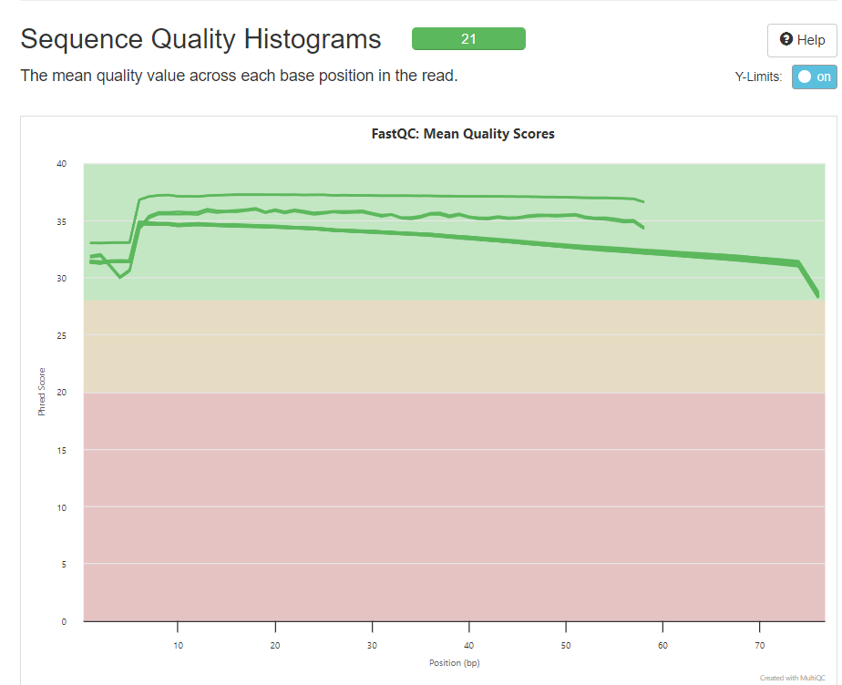

> The mean quality scores >30 (Phred score) and have high-confidence base calls

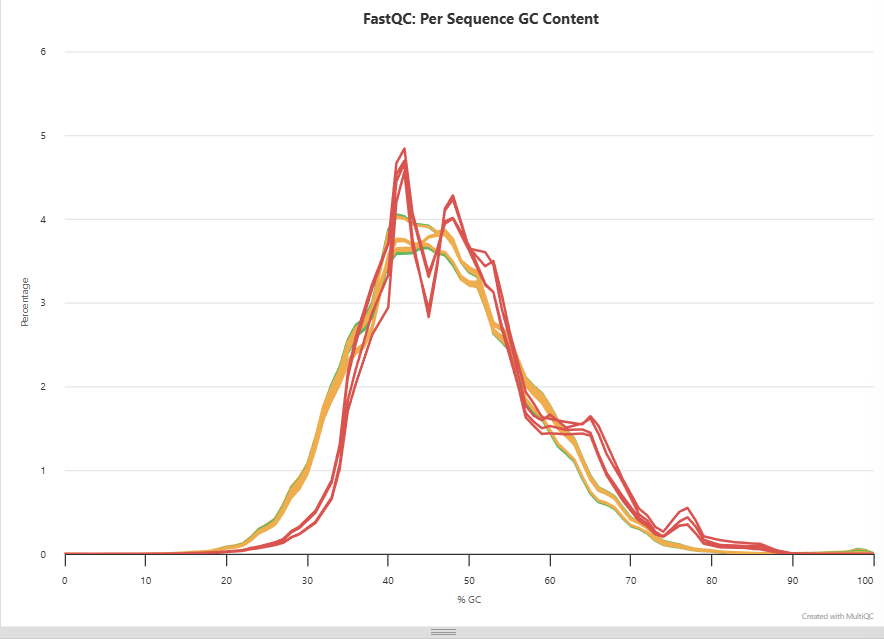  

> The GC content is around ideal content and library is prepared well 

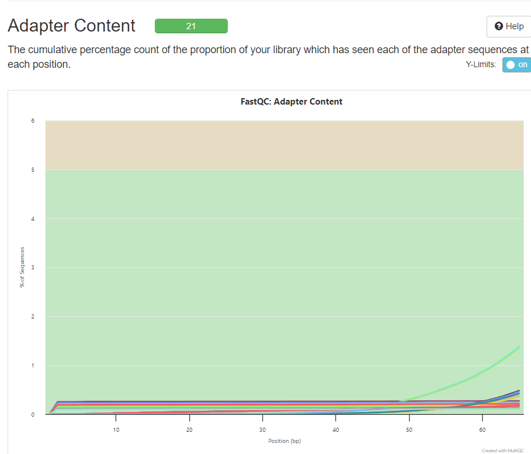 

> Minimal adapter content (<5%) as adapters already removed by `fastq-dump --clip`. Adaptor sequences will also be excluded during alignment
</p>

Trimming(skipped)
------------------
**Trimmomatic**

- Mean quality scores >30 (Phred score)
- Read length is short (76 bp) — trimming would create short reads
Since the reads have short length and adapter sequences at minimal, this step is skipped as it may introduce, shorter reads, biasness and reduced statistical power.

<p>
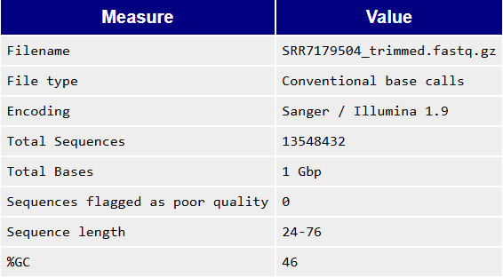 
 
> Example of trimmed SRA file with reads at 26bp

</p>

Mapping reads using HISAT2
---------------------------
**HISAT2**

Among splice-aware aligners, STAR aligner provides more accurate and sensitive mapping
- HISAT2 is used here because it uses less memory and is significantly faster
- Automated processing: scripts/hisat_align.p

Sorting and Indexing BAM Files using SAMtool
--------------------------------------------
**SAMtool**

In order to achieve fast retrieval of alignments mapped to regions without having to process the entire set of alignments. 

Checking strandedness using FeatureCounts
-----------------------------------------
**FeatureCounts**

The library was prepared using TruSeq® Stranded mRNA Library Prep Kit and therefore reads are reverse stranded. In order to confirm, featureCounts were run on one sample under different standedness condition:

| Strand condition     | Assigned reads         | Unassigned_Ambiguity  | 
|----------------------|------------------------|-----------------------|
| Unstranded           | 35,704,156             |  4,056,493            |
| Forward-strand       | 2,546,478              |  71345                |
| Reverse-strand       | **37,370,684**         |  1,957,456            |          

This confirms that the read is reverse-stranded

Mapping Quality using Qualimap
-------------------------------------
**Qualimap**


Read summarisation using FeatureCounts
-------------------------------------
**FeatureCounts**

- 10-20× faster than HTSeq-count
- Lightweight and memory efficient
- Multi-mapping handling by counting ambiguous reads fractionally

---
## Downstream analysis
## Downstream analysis
Ensemble IDs to gene symbols using BioMart
------------------------------------------
Gene annotations (Ensemble ID, gene name, gene type) were downloaded via Ensembl BioMart <https://asia.ensembl.org/biomart/martview/03b16017eeb03b816d404a27eb7d9a55> and merged with the raw count matrix using Ensemble IDs.
Data filtering
--------------
- Filtered the annotated count matrix to retain only protein-coding and immune-related gene types, reducing noise and focusing on - biologically relevant signals
- Genes with zero expression in all but one sample might be a outlier and is removed to reduce technical noise. 

<div style="text-align: center;">
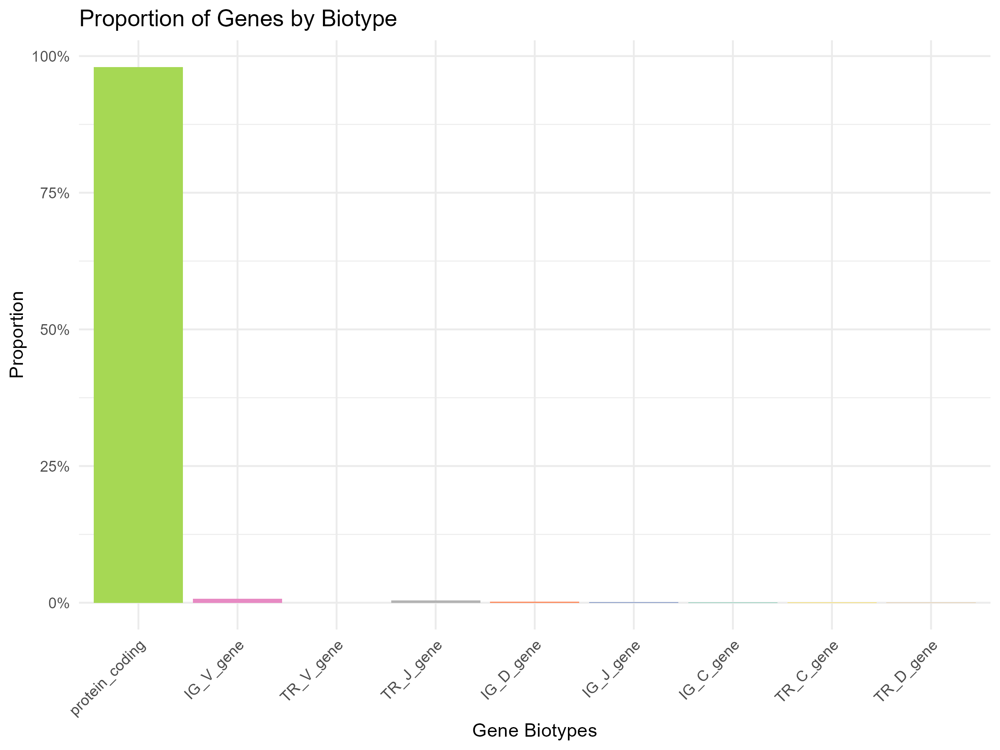
</div>

> **Figure: Distribution of biotypes in filtered data:**
> The plots shows most of the dataset contains protein coding genes, with other biotpes such as immunogloblins and T-cell receptors in negligible proportions.

PCA plot for batch effects
---------------------
> **Figure: PCA after DESeq:**
> PCA shows the variance structure after removal of batch effect in the dataset. Here the clustering is seen to be similar to PCA plot before DESEQ which indicates minimal batch effect.

## Distance plot 
<div style="text-align: center;">
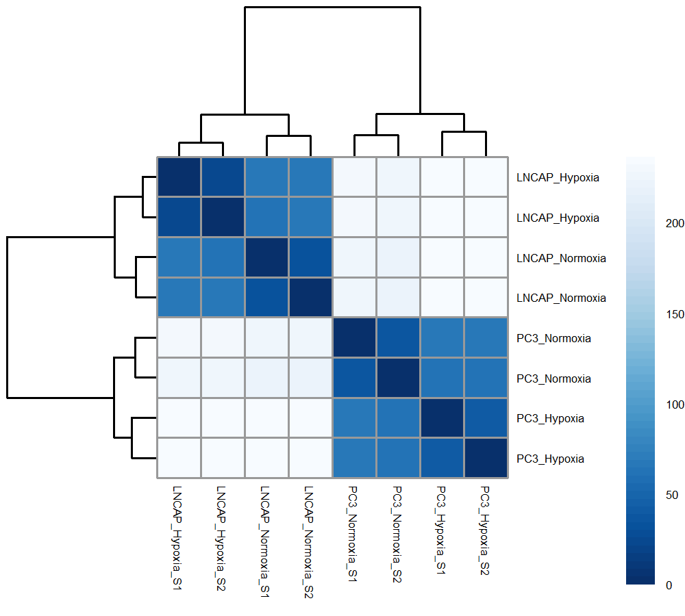
</div>

> **Figure: Clustered Heatmap of Gene Expression:**
> The heatap show distinct clustering across samples based on cell lines and oxygen conditions. This indicates that experiment was successfull

Variable genes HeatMap
----------------------
<div style="text-align: center;">
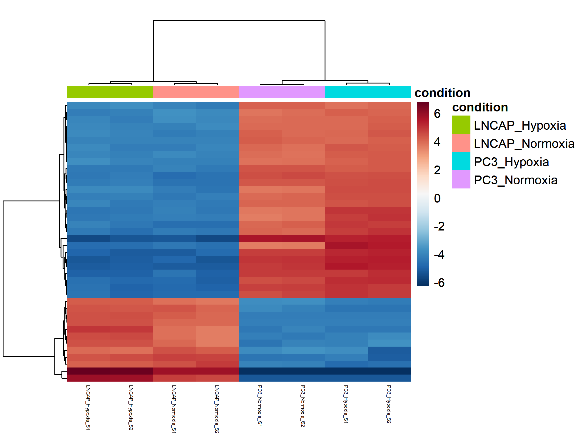
</div>

> **Figure: Clustered Heatmap of Gene Expression:**
> The heatap visualizes gene expression levels across samples under hypoxia and normoxia in LNCaP and PC3 cell lines. The blue-to-red gradient reflects low to high expression, respectively. Hierarchical clustering reveals  sample clusters based on variability in gene expressions, highlighting transcriptional differences due to both oxygen condition and cell type.

Raw vs VST-transformed data
------------------------------------------
Plotted density curves for raw and VST-transformed counts across all samples to check how well variance was stabilized. This helps confirm that expression distributions are more comparable post-transformation using VST.
<div style="text-align: center;">
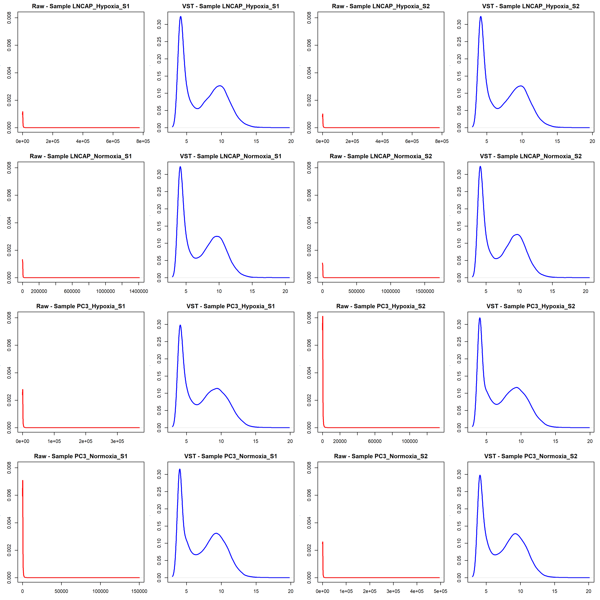
</div>

> **Figure: Density plots of raw vs. VST-transformed expression values:**
> The plots indicate that raw expression values have a highly skewed distribution, with particularly high variance in low-count regions. This variability makes raw data difficult to compare across samples. After applying Variance Stabilizing Transformation (VST), the distributions become more symmetric and bell-shaped, with variance stabilized across the range of expression values. This transformation enhances comparability between samples and prepares the data for downstream statistical analysis.

Gene expression profile - IGFBP1
--------------------------------
<div style="text-align: center;">
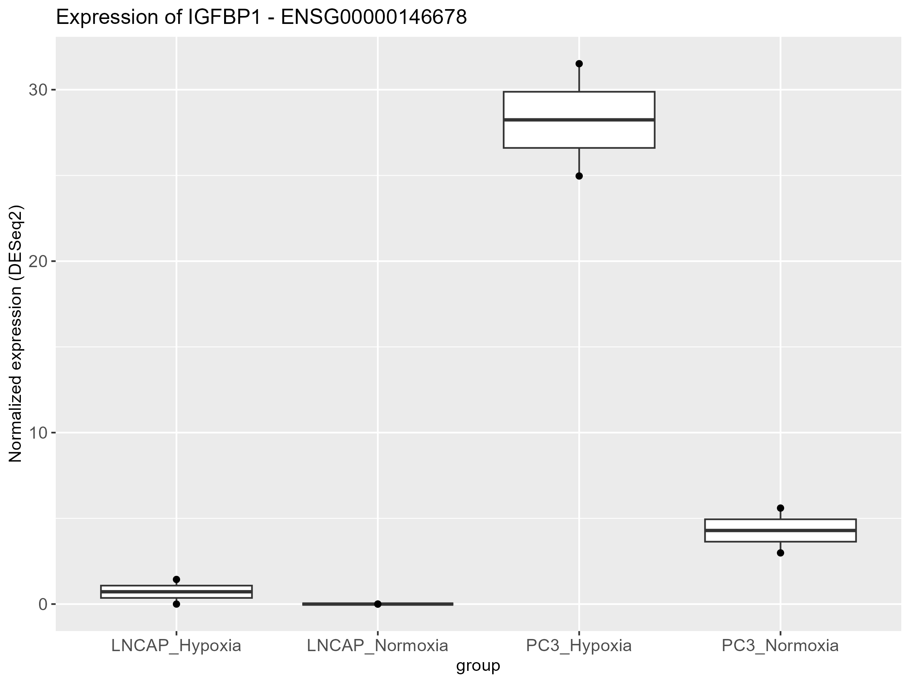
</div>

> **Figure: Normalized expression of IGFBP1 across conditions:**
> This boxplot shows the DESeq2-normalized expression of IGFBP1 (ENSG00000146678) across sample conditions. Higher expression in seen in PC3 cell lines when compared to low levels in LNCAP cell. Among PC3 cells,  higher levels of expression is seem in low oxygen condition. These patterns suggest that IGFBP1 is upregulated under hypoxia in PC3 cells, highlighting a potential cell line–specific response to oxygen stress.

---

# LNCAP - Hypoxia VS Normoxia

The LNCAP sampled were filtered from dataset, to compare hypoxia vs normoxia. 

Volcano plot - gene regulation
-------------------------------
<div style="text-align: center;">
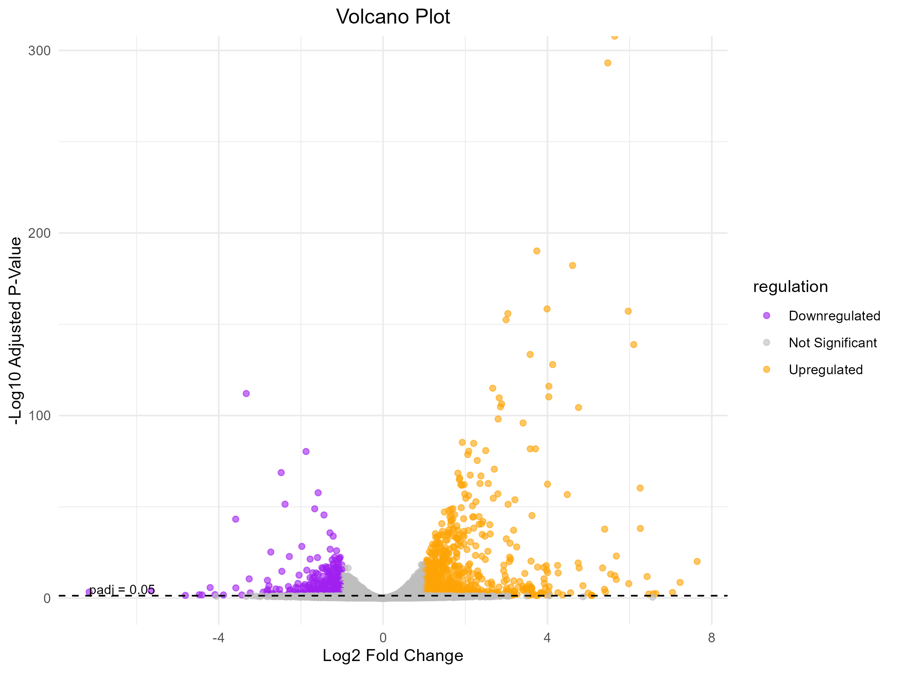
</div>

> **Figure:  Volcano plot of differential gene expression in LNCAP:** 
> The volcano plot displays the results of differential expression analysis, with log₂ fold change on the x-axis and –log₁₀ adjusted p-value on the y-axis. Genes with p-adj < 0.05, are grouped as upregulated (log₂ fold change > 1)are shown in orange, downregulated (log₂ fold change < 1) in purple, and non-significant (p-adj > 0.05) in grey. Under the oxygen stress condition, more genes are upregulated than downregulated, indicating increased transcriptional expression.

Gene Set Enrichment Analysis (GSEA)
-----------------------------------
GSEA results are sorted by adjusted p-value and normalized enrichment score (NES) to highlight the most responsive pathways. Here entire expression profile (including non-significant genes) is considered
<div style="text-align: center;">
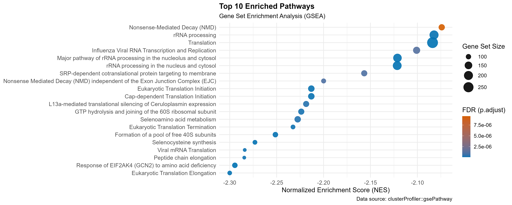
</div>

> **Figure: Top enriched pathways in LNCAP:**
> The plot shows top enriched pathway based on normalised enrichment scores(NES). The NES values are negative, indicating significant downregulation in these pathway during low oxygen stress. The dot size reflects number of genes involved and dot color indicates statistical significance based on FDR-adjusted p-vlaue.The supressed pathway include transalation, ribosomal RNA processing and protein synthesis-related pathway along with nonsense-mediated deacy and selenometabolism indicating reduction in energy-intensive protein production and RNA turnover. 

## Pathway enrichment by significant DEGs
<div style="text-align: center;">
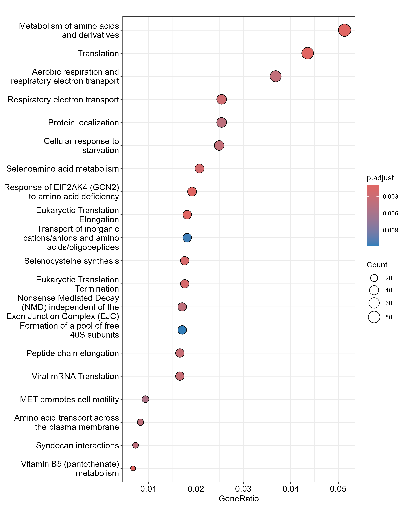
</div>

> **Figure: Pathways enriched by significant genes in LNCAP:**
> The dot plot shows enriched pathways ranked by significant differentially expressed genes. The gene-ratio is based on the percentage on DEGs involved in pathway. The dot size reflects number of genes involved and dot color indicates statistical significance based on FDR-adjusted p-vlaue. Enriched pathways include metabolism of amino acids, transalation, respiratory electron transport and stress responses

## GSEA of Hallmark Programs 
<div style="text-align: center;">
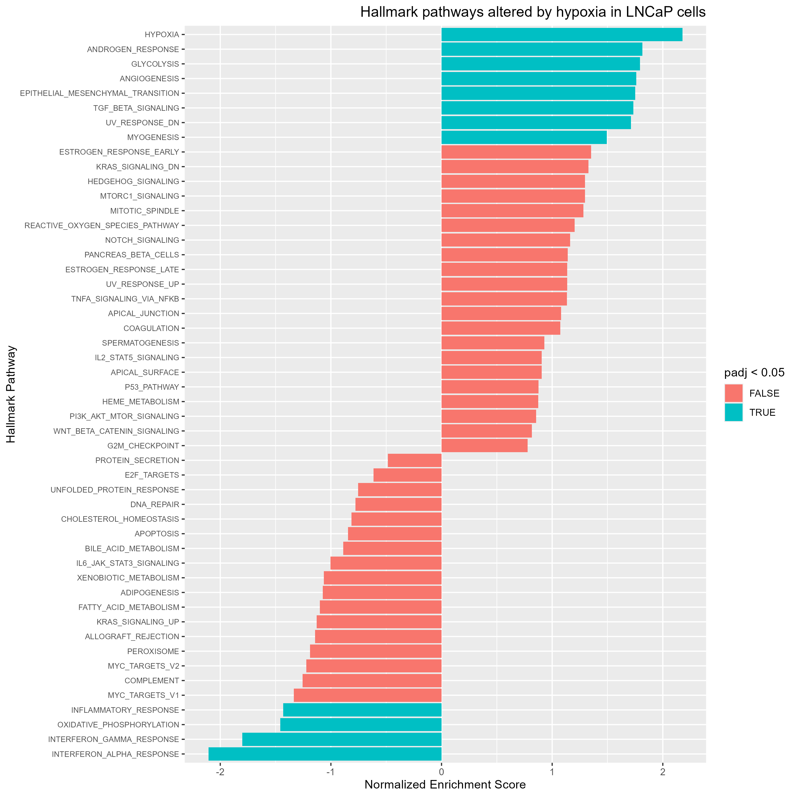
</div>

> **Figure: Hallmark pathway enrichment analysis in LNCaP cells under hypoxia:**
Bar plot of normalized enrichment scores (NES) showing pathways significantly altered under hypoxia. The blue bars indiactes the significantly enriched pathway with padj-values<0.05  Pathways such as glycolysis, angiogenesis, EMT, and TGF-beta signaling were significantly upregulated, support tumor survival and progression in low-oxygen environments. In contrast, oxidative phosphorylation, interferon responses, and inflammatory pathways were significantly downregulated, indicating suppression of anti-tumor immune activity and a metabolic shift away from mitochondrial respiration.
---

# PC3 - Hypoxia VS Normoxia

Volcano plot - gene regulation
------------------------------
<div style="text-align: center;">
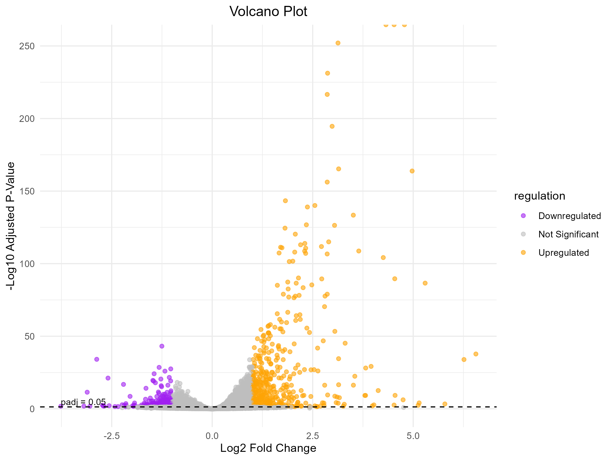
</div>

Gene Set Enrichment Analysis (GSEA)
-----------------------------------
<div style="text-align: center;">
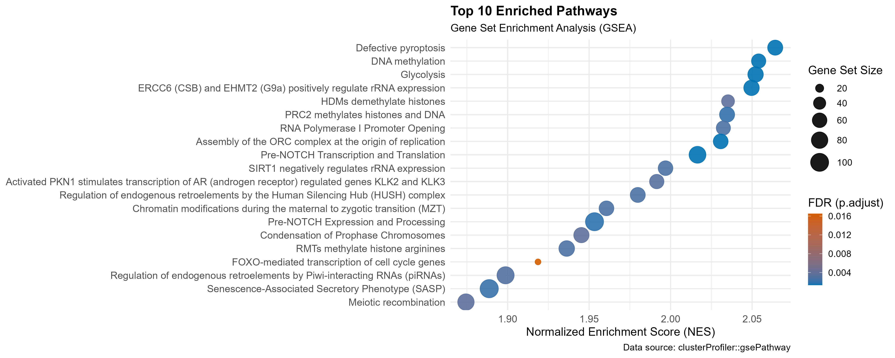
</div>

## Pathway enrichment by significant DEGs
<div style="text-align: center;">
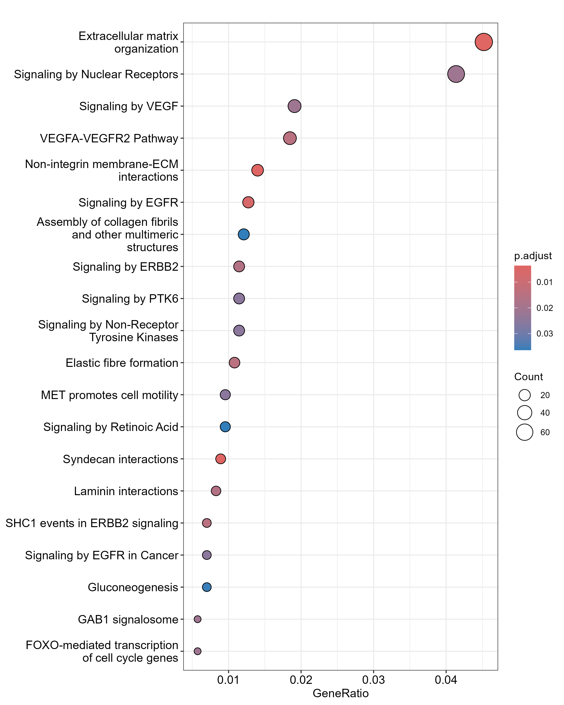
</div>

## GSEA of Hallmark Programs
<div style="text-align: center;">
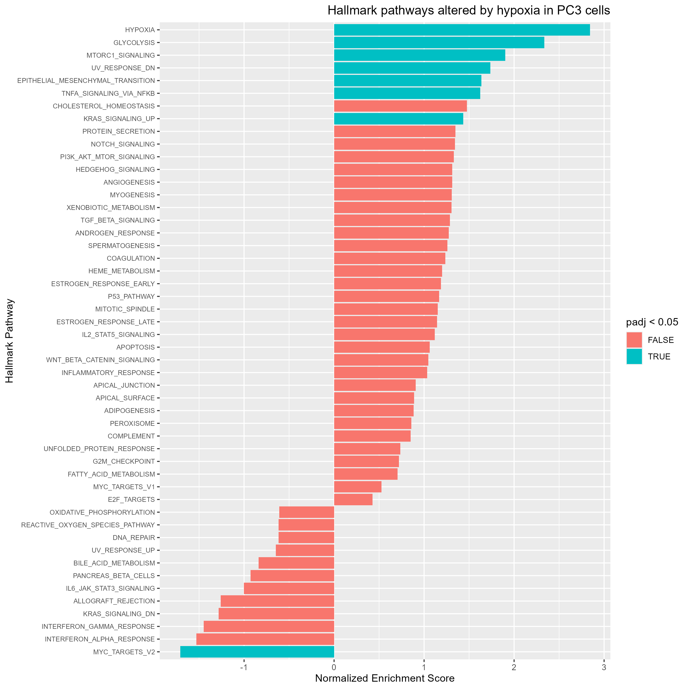
</div>

---

### Session info
```{r}
sink("session_info.txt")
sessionInfo()
sink()
```

*THE END*


[^1]:https://bioconductor.org/packages/devel/bioc/vignettes/Rsubread/inst/doc/SubreadUsersGuide.pdf             