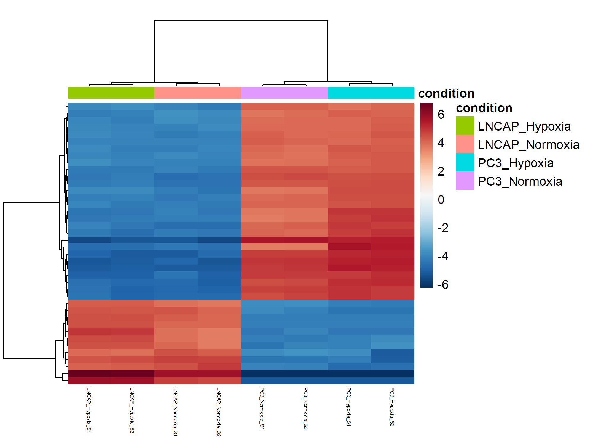

# Bulk RNA-Seq Analysis Project with GSEA

This repository contains a complete workflow for bulk RNA-seq analysis, from raw sequence data to differential gene expression and pathway enrichment analysis. The project demonstrates RNA-seq preprocessing, quality control, alignment, quantification, differential expression, and Gene Set Enrichment Analysis (GSEA) using R, Python, and standard bioinformatics tools.

---

## Project Overview

The goal of this project is to analyze bulk RNA-seq data to identify differentially expressed genes (DEGs) and enriched biological pathways. The workflow includes:

1. Data Acquisition: Download raw RNA-seq data (SRA format) and convert to FASTQ.
2. Quality Control: Assess read quality using FastQC and MultiQC.
3. Pre-processing: (Optional) trimming of adapters and low-quality reads using Trimmomatic.
4. Alignment: Map reads to reference genome using HISAT2 to human reference genome GRCh38_p14 .
5. Sorting and indexing using SAMtools 
6. Quantification: Count reads per gene using featureCounts.
7. Differential Expression Analysis: Perform DE analysis with DESeq2.
8. Gene Set Enrichment Analysis (GSEA): Identify enriched pathways from DE genes.
9. Visualization: Generate PCA plots, heatmaps, volcano plots, and GSEA enrichment plots.

---

## Folder Structure
```
bulk_rna_seq_prj/
├── data/               # Processed RNA-seq data and metadata
├── scripts/            # Analysis scripts (R, Python, Bash)
├── results/            # DE results, GSEA results, plots
├── README.txt          # Project documentation
└── environment.yml     # Dependencies for reproducibility
```
---
## Setup & Installation

**Programs required:** It is recommended that the user have Anaconda installed, through which all required programs can be installed. Assuming that Anaconda is available, all the required programs can be installed using the following:
```bash
#Install the required programs using anaconda
conda create -n preprocess python=3.7

conda install -n preprocess -c bioconda fastqc
conda install -n preprocess -c trimmomatic
conda install -n preprocess -c bioconda multiqc
conda install -n preprocess -c hisat2
conda install -n preprocess -c samtools
conda install -n preprocess -c subread
```

The NCBI’s SRA toolkit is installed, and the path is added to the /.bashrc configuration file:
```bash
#Install SRA toolkit
sudo apt install sra-toolkit

#Adding PATH to configuration file
nano ~/.bashrc
export PATH="/home/amina/sratoolkit/bin:$PATH"
source ~/.bashrc
```

The conda environment needs to be activated before running the pipeline using command:
```bash
conda activate preprocess
```
---
## Pre-processing Pipeline

The dataset was produced as part of the research [Guo et al., Nature Communications 2019](https://www.ncbi.nlm.nih.gov/pubmed/30655535). The raw sequencing data are obtained via Gene Expression Omnibus (GEO) using the accession number provided in the publication: GSE106305. The corresponding webpage contains information regarding the sequencing data for each sample in the study. 
The objective was to find the differentially expressed under conditions of normoxia, normal oxygen condition of typically 21% O2, and hypoxia, low oxygen condition of typically 1-5% O2, for cell lines LNCAP and PC3. For this, the control samples (Empty\_Vector for LNCaP and siCtrl for PC3) were selected. The samples to be downloaded and associated SRA accession numbers are in the table below:
| Sample Name                                   | GSM Identifier | SRA Identifier (SRX) | SRA Runs (SRR, download these)                     |
|-----------------------------------------------|----------------|----------------------|----------------------------------------------------|
| LNCaP\_RNA-Seq\_Empty\_Vector\_Normoxia\_rep1 | GSM3145509     | SRX4096735           | SRR7179504  SRR7179505  SRR7179506  SRR7179507 |
| LNCaP\_RNA-Seq\_Empty\_Vector\_Normoxia\_rep2 | GSM3145510     | SRX4096736           | SRR7179508  SRR7179509  SRR7179510  SRR7179511 |
| LNCaP\_RNA-Seq\_Empty\_Vector\_Hypoxia\_rep1  | GSM3145513     | SRX4096739           | SRR7179520  SRR7179521  SRR7179522  SRR7179523 |
| LNCaP\_RNA-Seq\_Empty\_Vector\_Hypoxia\_rep2  | GSM3145514     | SRX4096740           | SRR7179524  SRR7179525  SRR7179526  SRR7179527 |
| PC3\_RNA-Seq\_siCtrl\_Normoxia\_rep1          | GSM3145517     | SRX4096743           | SRR7179536                                         |
| PC3\_RNA-Seq\_siCtrl\_Normoxia\_rep2          | GSM3145518     | SRX4096744           | SRR7179537                                         |
| PC3\_RNA-Seq\_siCtrl\_Hypoxia\_rep1           | GSM3145521     | SRX4096747           | SRR7179540                                         |
| PC3\_RNA-Seq\_siCtrl\_Hypoxia\_rep2           | GSM3145522     | SRX4096748           | SRR7179541                                         |

Download FASTQ files using SRA tools
------------------------------------
The sequencing data is stored in the NCBI database in the form of SRA files, which can be downloaded using NCBI’s SRA toolkit. The `prefetch` command downloads the SRA files based on the specified SRA accession number. 
```bash
prefetch SRR7179504

2025-08-27T05:28:06 prefetch.3.2.1: 1) Resolving 'SRR7179504'...
2025-08-27T05:28:10 prefetch.3.2.1: Current preference is set to retrieve SRA Normalized Format files with full base quality scores
2025-08-16T05:28:12 prefetch.3.2.1: 1) Downloading 'SRR7179504'...
2025-08-16T05:28:12 prefetch.3.2.1:  SRA Normalized Format file is being retrieved
2025-08-16T05:28:12 prefetch.3.2.1:  Downloading via HTTPS...
2025-08-16T05:29:00 prefetch.3.2.1:  HTTPS download succeed
2025-08-16T05:29:04 prefetch.3.2.1:  'SRR7179504' is valid: 439677804 bytes were streamed from 439667257
2025-08-16T05:29:04 prefetch.3.2.1: 1) 'SRR7179504' was downloaded successfully
2025-08-16T05:29:04 prefetch.3.2.1: 1) Resolving 'SRR7179504's dependencies...
2025-08-16T05:29:04 prefetch.3.2.1: 'SRR7179504' has 0 unresolved dependencies
```
The downloaded SRA file “SRR7019504” is then read into FASTQ file. For this the command `fastq-dump`:
```bash
fastq-dump --outdir fastq --gzip --skip-technical  --readids --read-filter pass --dumpbase --split-3 --clip /mnt/d/BI_prj/bulkrnaseq_proj/normoxia_vs_hypoxia/SRR7179504/SRR7179504.sra

Rejected 13548432 READS because of filtering out non-biological READS
Read 13548432 spots for /mnt/d/BI_prj/bulkrnaseq_proj/normoxia_vs_hypoxia/SRR7179504/SRR7179504.sra
Written 13548432 spots for /mnt/d/BI_prj/bulkrnaseq_proj/normoxia_vs_hypoxia/SRR7179504/SRR7179504.sra
```
`--outdir fastq`           : Specifies the output directory for the FASTQ files  
`--gzip`                   : Compresses the output FASTQ files using gzip  
`--skip-technical`         : Skips technical reads (e.g., control reads or adapters)  
`--readids`                : Includes read identifiers in the FASTQ header  
`--read-filter pass`       : Filters out low-quality reads; keeps only those marked "pass"  
`--dumpbase`               : Outputs base calls (A, T, G, C, N) instead of color space  
`--split-3`                : Splits paired-end reads into separate files (`_1.fastq.gz`, `_2.fastq.gz`)  
`--clip`                   : Removes adapter sequences from reads  
`~/sra/...`                : Path to the input SRA file  

A compressed file `SRR7179504_pass.fastq.gz` is created in the subdirectory called `fastq`. 
Since multiple SRA files are to be downloaded, a python script is written to automate the process. The code is provided in [`scripts/fastq_download.py`](scripts/fastq_download.py) and is as follows:
```python
import subprocess
import time

sra_numbers = [
    "SRR7179504", "SRR7179505", "SRR7179506", "SRR7179507",
    "SRR7179508", "SRR7179509", "SRR7179510", "SRR7179511",
    "SRR7179520", "SRR7179521", "SRR7179522", "SRR7179523",
    "SRR7179524", "SRR7179525", "SRR7179526", "SRR7179527",
    "SRR7179536", "SRR7179537", "SRR7179540", "SRR7179541"
]

for sra_id in sra_numbers:
    print("\n=== Downloading:", sra_id, "===")
    prefetch_cmd = f"prefetch {sra_id}"
    print("Command:", prefetch_cmd)

    start_time = time.time()
    subprocess.call(prefetch_cmd, shell=True)
    end_time = time.time()

    elapsed_min = (end_time - start_time) / 60
    print(f"⏱ Download time for {sra_id}: {elapsed_min:.2f} minutes")

for sra_id in sra_numbers:
    sra_path = f'"../{sra_id}/{sra_id}.sra"'
    print("\n=== Generating FASTQ for:", sra_id, "===")
    fastq_dump_cmd = (
        f"fastq-dump --outdir fastq --gzip --skip-technical "
        f"--readids --read-filter pass --dumpbase --split-3 --clip {sra_path}"
    )
    print("Command:", fastq_dump_cmd)

    start_time = time.time()
    subprocess.call(fastq_dump_cmd, shell=True)
    end_time = time.time()

    elapsed_min = (end_time - start_time) / 60
    print(f"⏱ FASTQ generation time for {sra_id}: {elapsed_min:.2f} minutes")
```
All the SRA files are now downloaded in subdirectory `fastq` wth path to sra file being `/SRR*/SRR*.sra`

Pre-alignment QC
----------------
The raw sequence data is assessed for quality. The following command is used to generate FastQC reports for samples in order to evaluate sequence quality, GC content, duplication rates, length distribution, K-mer content, and adapter contamination. The results are then recorded in the subdirectory "/fastq_results."
```bash
fastqc fastq/*.fastq.gz -o fastqc_results/ --threads 8
```

The fastqc reports can be combined into one summary report using `Mulitqc` with the following command:
```bash
multiqc fastqc_results/ -o multiqc_report/
```

Trimming(optional)
------------------
Trimming is pre-alignment step to remove adapter sequences and low-quality bases. The step us done based on the FASTqc report generated earlier which show the quality scores. The following command is used to trim SRR7079504:
```bash
trimmomatic SE -threads 4 SRR7179504_pass.fastq.gz SRR7179504_trimmed.fastq.gz TRAILING:10 -phred33
```
After the trimming process, the quality of the read is once again assessed.

Since the reads have short length and adapter sequences removed during FASTQ file conversion, this step is skipped as it may introduce biasness and poor alignment (lenient filtering is done since the reads are used for quantification).

### Concatenating FASTQ files to sample files
The LNCAP samples are associated with four SRA files each and is concatenated into single FASTQ file using the command:
```bash
cat SRR7179504_pass.fastq.gz SRR7179505_pass.fastq.gz SRR7179506_pass.fastq.gz SRR7179507_pass.fastq.gz  > LNCAP_Normoxia_S1.fastq.gz
cat SRR7179508_pass.fastq.gz SRR7179509_pass.fastq.gz SRR7179510_pass.fastq.gz SRR7179511_pass.fastq.gz  > LNCAP_Normoxia_S2.fastq.gz
cat SRR7179520_pass.fastq.gz SRR7179521_pass.fastq.gz SRR7179522_pass.fastq.gz SRR7179523_pass.fastq.gz  > LNCAP_Hypoxia_S1.fastq.gz
cat SRR7179524_pass.fastq.gz SRR7179525_pass.fastq.gz SRR7179526_pass.fastq.gz SRR7179527_pass.fastq.gz  > LNCAP_Hypoxia_S2.fastq.gz
```

The PC3 sample are associated with only one SRA file and is therefore renamed to the sample names using command:
```bash
mv SRR7179536_pass.fastq.gz PC3_Normoxia_S1.fastq.gz
mv SRR7179537_pass.fastq.gz PC3_Normoxia_S2.fastq.gz
mv SRR7179540_pass.fastq.gz PC3_Hypoxia_S1.fastq.gz
mv SRR7179541_pass.fastq.gz PC3_Hypoxia_S2.fastq.gz
```

Mapping reads using HISAT2
---------------------------
The reads from FASTQ file are aligned to a reference genome, where the reads are matched based on sequence similarity in the reference genome. This tells us which part of the gene was transcribed for the mRNA, and the number of times a read is mapped to a specific gene indicates whether the gene expression was high or low.

### Concept behind mapping
To perform bulk-RNA sequence analysis,  library is created. The mRNA transcripts from cells are reverse transcribed into cDNA, fragmented and are attached with adapter sequences in both ends and this created the library. The sequencer reads the fragments and stores the sequence in FASTQ files. The FASTQ file consists of 4-line chunks, as shown
```bash
zcat LNCAP_Hypoxia_S1.fastq.gz | head -4

@SRR7179520.1.1 1 length=76    
GTGAANATAGGCCTTAGAGCACTTGANGTGNTAGNGCANGTNGNNCCGGAACGNNNNNNNNAGGTNGNNNGNGTTG
+SRR7179520.1.1 1 length=76
AAAAA#EEEEEEEEEEEEEEEEEEEE#EEE#EEE#EEE#EE#E##EEEEEEEE########EEEE#E###E#EAEA
```
 1. Sequence identifier(starts with @)
 2. Read sequence
 3. Separator line(starts with +)
 4. Quality score of each base (based on ASCII)

### Mapping reads
The pre-built genome index, required for mapping, is downloaded using the `wget` command and is extracted using `tar -xvzf` command:
```bash
wget https://genome-idx.s3.amazonaws.com/hisat/grch38_genome.tar.gz

tar -xvzf grch38_genome.tar.gz
```
The reads from FASTQ files are aligned to genome index using HISAT2, which does splice-aware alignment for the LNCAP_Normoxia_S1:
```bash
hisat2 -p 8 -x GRCh38_index -U LNCAP_Normoxia_S1_R1_001.fastq.gz -S LNCAP_Normoxia_S1.sam
```
 ` -p ` : Number of threads to be used                          
 ` -x ` : Genome index to be used                                         
 ` -U ` : Unpaired-reads to be aligned                                        
 ` -S ` : Write file to SAM alignment                                              

> [!NOTE] 
> STAR aligner provides more accurate and sensitive mapping; however, HISAT2 is used here because it uses less memory and is significantly faster

The output BAM file consists of 11 fields for alignment information: 
```bash
samtools view LNCAP_Normoxia_S2.bam | head -n 1

SRR7179504.1361607.1    272     1       14277   0       76M     *0       0       GAAACAGGGCCGCGGGGAGCGGCTGCCCCCACTGCCTAGGGACCAACAGGGGCAGGAGGCAGTCACTGACCCCGAG     //</EEEE/E//</6//EEE//E/AEEEE<//AEEEAAEEEEEEE<AEEEEEAEEEEEEEEE6EEEEEEEEAAAAA     AS:i:-15        ZS:i:-15 XN:i:0  XM:i:5  XO:i:0  XG:i:0  NM:i:5  MD:Z:8T1A2T6T0T54YT:Z:UU NH:i:3
```
 1. QNAME -Read name
 2. FLAG - bitwise flag
 3. RNAME - Chromosome (if read is not aligned '*')
 4. POS - 1-based left-most mapping position
 5. MAPQ - Mapping quality
 6. CIGAR - describes the position of instertion(I),deletion(D) and matches(M) in alignment
 7. RNEXT - name of the pair sequence (in pair-ended sequences) - * unpaired
 8. PNEXT - position of pair 
 9. TLEN - Total span (size of pair reads and distance between them)
  10. SEQ - Read Sequence
  11. QUAL - Phred quality
 and TAG - TAG information (AS - alignment score, NH - number of reported alignments 

Sorting and Indexing BAM Files using SAMtool
--------------------------------------------
After alignment, the BAM files created are unsorted. The samtools sort and index the BAM file based on genomic coordinates, which is essential for downstream analysis. The aim is to achieve fast retrieval of alignments mapped to regions without having to process the entire set of alignments. The file is sorted based on:
1. Chromosome name
2. Start position 

Since multiple files need to be aligned to the genome index, sorted, and indexed using samtool, the process is automated using a Python script. The code is provided in [`scripts/hisat_align.py`](scripts/hisat_align.py):
```python
files = [
    "LNCAP_Normoxia_S1.fastq.gz",
    "LNCAP_Normoxia_S2.fastq.gz",
    "LNCAP_Hypoxia_S1.fastq.gz",
    "LNCAP_Hypoxia_S2.fastq.gz",
    "PC3_Normoxia_S1.fastq.gz",
    "PC3_Normoxia_S2.fastq.gz"
]

logfile = "alignment_log.txt"

for file in files:
    sample_name = os.path.basename(file).replace(".fastq.gz", "")
    timestamp = datetime.now().strftime("%Y-%m-%d %H:%M:%S")
    log_entry = f"{timestamp} - Processing {sample_name}\n"
    with open(logfile, "a") as log:
        log.write(log_entry)
    
    start_time = time.time()

    hisat2_exec = (
        f"hisat2 -x grch38_genome -U fastq/{file} | "
        f"samtools sort -o {file}.bam && "
        f"samtools index {file}.bam"
    )
    subprocess.run(hisat2_exec, shell=True)

    end_time = time.time()
    duration = end_time - start_time
    log_entry = f"{timestamp} - Finished processing {sample_name} in {duration:.2f} seconds\n"
    with open(logfile, "a") as log:
        log.write(log_entry)
    print(f"Processed {sample_name} in {duration:.2f} seconds")


print("All commands executed successfully")
```

Read summarisation using FeatureCounts
-------------------------------------
The reads are quantified using FeatureCounts, which uses genomic coordinates in BAM files and maps to genomic features based on annotation in the reference genome.
```bash
featureCounts -s 0 -a ../fastq/Homo_sapiens.GRCh38.114.gtf \
        -o ../fastq/{bam}_featurecounts.txt \
        {bam}"
```
 ` -s ` : Indicate if strand-specific read counting should be performed.        
 ` -a ` : The annotation file to be used                 
 ` -o ` : Name of the output directory          
 `{bam}`: Name of the BAM file to be used

The FeatureCounts output includes a count table, that contains read count for genome features, and summary of counting results
The count table includes annotation columns: Geneid, Chr, Start, End, Strand, and Length, and reads counts for each genes. The count summary includes number of alignments that were successful and also number of assignment that failed.

Since multiple files needs to be quantified, the following python script [`scripts/feature_counts.py`](scripts/feature_counts.py) is used:
```python
bam_files = [
    "LNCAP_Normoxia_S1.bam",
    "LNCAP_Normoxia_S2.bam",
    "LNCAP_Hypoxia_S1.bam",
    "LNCAP_Hypoxia_S2.bam",
    "PC3_Normoxia_S1.bam",
    "PC3_Normoxia_S2.bam",
    "PC3_Hypoxia_S1.bam",
    "PC3_Hypoxia_S2.bam"
]

# Loop over all BAM files
for bam in bam_files:
    start=time.time()  # start time

    print(f"{start} Processing {bam} ...")
    featurecounts = f"featureCounts -s 0 -a ../fastq/Homo_sapiens.GRCh38.114.gtf \
        -o ../fastq/{bam}_featurecounts.txt \
        {bam}"
    subprocess.run(featurecounts, shell=True)

    end=time.time()  # end time
    runtime=(( (end - start) / 60 ))  # in minutes

    print(f"✅ Completed {bam} in {runtime} minutes.")
```
After generating count tables and count summary for all the samples, the read counts for samples are merged using [`scripts/generating_countsmatrix.ipynb`](scripts/generating_countsmatrix.ipynb) into one dataset [`data/GSE106305_counts_matrix.csv`](data/GSE106305_counts_matrix.csv) 

---
## Downstream analysis
Installing necessary packages
-----------------------------
```{r}
# install necessary libraries
install.packages("BiocManager")
BiocManager::install(version = "devel")
BiocManager::install("DESEQ2")
BiocManager::install("ReactomePA")

```


Loading count data and meta data
--------------------------------
The count matrix created is load and column are sample-wise
```{r}
#Loading counts after running featureCounts
raw_counts <- read.csv("data/GSE106305_counts_matrix.csv", header = TRUE, row.names = "Geneid", stringsAsFactors = FALSE)
raw_counts <- raw_counts[,sort(colnames(raw_counts))]
head(raw_counts)
colSums(raw_counts)
## LNCAP_Hypoxia_S1  LNCAP_Hypoxia_S2 LNCAP_Normoxia_S1 LNCAP_Normoxia_S2 
##         35704156          40621142          38248072          46410350 
##   PC3_Hypoxia_S1    PC3_Hypoxia_S2   PC3_Normoxia_S1   PC3_Normoxia_S2 
##         36884023          12629194          12917476          38077829
```
The metadata is created where the condition for each sample is stored
```{r}
#setting up metadata
condition <- c(rep("LNCAP_Hypoxia", 2), rep("LNCAP_Normoxia", 2), rep("PC3_Hypoxia", 2), rep("PC3_Normoxia", 2))
print(condition)

my_colData <- as.data.frame(condition)
rownames(my_colData) <- colnames(raw_counts)
head(my_colData)
write.csv(my_colData,file = "data/metadata.csv")
##                        condition
## LNCAP_Hypoxia_S1   LNCAP_Hypoxia
## LNCAP_Hypoxia_S2   LNCAP_Hypoxia
## LNCAP_Normoxia_S1 LNCAP_Normoxia
## LNCAP_Normoxia_S2 LNCAP_Normoxia
## PC3_Hypoxia_S1       PC3_Hypoxia
## PC3_Hypoxia_S2       PC3_Hypoxia
```

Creating DESeq Object
--------------------
```{r}
library(DESeq2)

dds <- DESeqDataSetFromMatrix(countData = raw_counts,
                              colData = my_colData,
                              design = ~condition)
dds
head(counts(dds))

## class: DESeqDataSet 
## dim: 78894 8 
## metadata(1): version
## assays(1): counts
## rownames(78894): ENSG00000000003 ENSG00000000005 ...
##   ENSG00000310576 ENSG00000310577
## rowData names(0):
## colnames(8): LNCAP_Hypoxia_S1 LNCAP_Hypoxia_S2 ... PC3_Normoxia_S1
##   PC3_Normoxia_S2
## colData names(1): condition

##                 LNCAP_Hypoxia_S1 LNCAP_Hypoxia_S2 LNCAP_Normoxia_S1
## ENSG00000000003              604              691               367
## ENSG00000000005                0                0                 0
## ENSG00000000419             1995             2302              2160
## ENSG00000000457              554              607               433
## ENSG00000000460              275              350               379
## ENSG00000000938                2                2                 2
##                 LNCAP_Normoxia_S2 PC3_Hypoxia_S1 PC3_Hypoxia_S2
## ENSG00000000003               380           1059            332
## ENSG00000000005                 0              0              0
## ENSG00000000419              2454           1974            693
## ENSG00000000457               518             88             26
## ENSG00000000460               349            390            155
## ENSG00000000938                 1              0              0
##                 PC3_Normoxia_S1 PC3_Normoxia_S2
## ENSG00000000003             352             971
## ENSG00000000005               0               0
## ENSG00000000419             747            1761
## ENSG00000000457              29              83
## ENSG00000000460             189             438
## ENSG00000000938               0               1
```

Genes with no gene expression across samples are checked. The table contains info in number of genes that have zero expression at different number of samples. 
```{r}
count_matrix <- counts(dds)
zero_counts_per_gene <- rowSums(count_matrix == 0)
count_matrix <- as.data.frame(count_matrix)
zero_summary <- table(zero_counts_per_gene)
print(zero_summary) #number of genes with diff. number of zero gene expression in samples

## zero_counts_per_gene
##     0     1     2     3     4     5     6     7 
## 19522  3391  2972  3281  5019  3858  4632  7435 
##     8 
## 28784 
```

Ensemble IDs to gene symbols using BioMart
------------------------------------------
Gene annotations (Ensemble ID, gene name, gene type) were downloaded via Ensembl BioMart <https://asia.ensembl.org/biomart/martview/03b16017eeb03b816d404a27eb7d9a55> and merged with the raw count matrix using Ensemble IDs.
```{r}
library(data.table)
library(dplyr)

annotation <- fread("data/GRCh38.p14_annotation.csv",stringsAsFactors = FALSE)
#renaming colnames
names(annotation)[names(annotation) %in% c("Gene stable ID", "Gene type", "Gene name")] <- c("Geneid", "Genebiotype", "Genesymbol")
annotation$Geneid <- sub("\\..*$","",annotation$Geneid)
head(annotation)
##             Geneid    Genebiotype Genesymbol
##             <char>         <char>     <char>
## 1: ENSG00000210049        Mt_tRNA      MT-TF
## 2: ENSG00000211459        Mt_rRNA    MT-RNR1
## 3: ENSG00000210077        Mt_tRNA      MT-TV
## 4: ENSG00000210082        Mt_rRNA    MT-RNR2
## 5: ENSG00000209082        Mt_tRNA     MT-TL1
## 6: ENSG00000198888 protein_coding     MT-ND1

#matrix to dataframe
raw_counts <-read.csv("data/GSE106305_counts_matrix.csv",
                     header = TRUE,
                     stringsAsFactors = FALSE)
raw_counts$Geneid <- sub("\\..*$","",raw_counts$Geneid)

annotated_data <- left_join(raw_counts,annotation, by = "Geneid")
head(annotated_data)
write.csv(annotated_data, file = "data/gene_annotated_raw_counts.csv")

```

Data filtering
--------------
Filtered the annotated count matrix to retain only protein-coding and immune-related gene types, reducing noise and focusing on biologically relevant signals
```{r}
genetypes_to_keep <- c("protein_coding", "IG_J_gene", "IG_V_gene", "IG_C_gene", "IG_D_gene", "TR_D_gene", "TR_C_gene", "TR_V_gene", "TR_J_gene")

filtered_counts<- annotated_data[annotated_data$Genebiotype %in% genetypes_to_keep,]
dim(filtered_counts)
filtered_counts$Geneid <- sub("\\..*$", "", filtered_counts$Geneid)

output_file <- "data/genetypes_counts_matrix.csv"
fwrite(filtered_counts, file = output_file, sep = ",", row.names = FALSE)

```

Low-expression genes (zero counts in ≥7 samples) were removed to improve statistical power(2 replicates for each condition)
```{r}
zero_counts1 <- rowSums(filtered_counts[, 4:11] == 0)
zero_summary2 <- table(zero_counts1)
print(zero_summary2)
#keep genes if less than 7 samples have zero expression (since 2 replicates)
keep_genes <- zero_counts1 < 7
filtered_counts_nozero <- filtered_counts[keep_genes, ]
cat("Number of genes after filtering (zeros in <7 samples):", nrow(filtered_counts_nozero), "\n")
## Number of genes after filtering (zeros in <7 samples): 20532

new_zero_counts <- rowSums(filtered_counts_nozero[, 4:11] == 0)
print(table(new_zero_counts)) #check if removed successfully 

output_file <- "data/genetype_nonzero_count_matrix.csv"
fwrite(filtered_counts_nozero, file = output_file, sep = ",",row.names= FALSE)

## new_zero_counts
##     0     1     2     3     4     5     6 
## 13601   951   877   744  1018   813  2528
```

DeseqDataSet is filtered for only the genes left in the filtered counts. A table for genes that were removed from desired genetypes was created
```{r}
dds_filtered <- dds[rownames(dds) %in% filtered_counts_nozero$Geneid, ]
cat("Dimensions of filtered DESeqDataSet:", dim(dds_filtered), "\n")
head(dds_filtered)

#list of zero gene expression > 7 sample under diff. gene types
removed_genes <- filtered_counts[!keep_genes, ]
cat("Biotype distribution of removed genes:\n")
print(table(removed_genes$Genebiotype)) 
```
The proportion of biotypes left is visualised after filtering. 
```{r}
library(ggplot2)

genetype_counts <-filtered_counts_nozero %>%
  count(Genebiotype) %>%
  mutate(Proportion = n/sum(n),
         Percentage = Proportion * 100) %>%
  rename(Biotype = Genebiotype)

#Barplot
p <- ggplot(genetype_counts, aes(x = reorder(Biotype, -Proportion), y = Proportion, fill = Biotype)) +
  geom_bar(stat = "identity") +
  labs(title = "Proportion of Genes by Biotype",
       x = "Gene Biotypes",
       y = "Proportion") +
  scale_y_continuous(labels = scales::percent_format(scale = 100)) +  # Show proportions as percentages
  theme_minimal() +
  theme(axis.text.x = element_text(angle = 45, hjust = 1),  # Rotate x-axis labels
        legend.position = "none") +  # Remove legend if biotypes are clear
  scale_fill_brewer(palette = "Set2")  # Use distinct colors
p
output_plot <- "results/genebiotype_proportions1.png"
ggsave(output_plot, plot = p, width = 8, height = 6, dpi = 300)
```


PCA plot before DESeq
---------------------
PCA clusters samples with similar gene expression before Deseq. The variable stabilising transformation is deals with genes that are highly expressed in small datasets.The plot helps us to visualise variance structure and potential batch effect
```{r}
#Stabilising variance across genes in sample
vsd <- vst(dds_filtered , blind = TRUE)

#plot PCA
plot_PCA = function (vsd.obj) {
  pcaData <- plotPCA(vsd.obj,  intgroup = c("condition"), returnData = T)
  percentVar <- round(100 * attr(pcaData, "percentVar"))
  ggplot(pcaData, aes(PC1, PC2, color=condition)) +
    geom_point(size=3) +
    labs(x = paste0("PC1: ",percentVar[1],"% variance"),
         y = paste0("PC2: ",percentVar[2],"% variance"),
         title = "PCA Plot colored by condition") +
    ggrepel::geom_text_repel(aes(label = name), color = "black")
}
png(filename = "results/pca_before.png", 
    width = 2000, height = 2000, res = 300)  # adjust width/height as needed
plot_PCA(vsd)
dev.off()
plot_PCA(vsd)
```


DESeq - for differential expressed genes
----------------------------------------
```{r}
dds <- DESeq(dds_filtered)
## estimating size factors
## estimating dispersions
## gene-wise dispersion estimates
## mean-dispersion relationship
## final dispersion estimates
## fitting model and testing

dds
## class: DESeqDataSet 
## dim: 20532 8 
## metadata(1): version
## assays(4): counts mu H cooks
## rownames(20532): ENSG00000000003 ENSG00000000005 ...
##   ENSG00000310562 ENSG00000310576
## rowData names(30): baseMean baseVar ... deviance maxCooks
## colnames(8): LNCAP_Hypoxia_S1 LNCAP_Hypoxia_S2 ... PC3_Normoxia_S1
##   PC3_Normoxia_S2
## colData names(2): condition sizeFactor

normalized_counts <- counts(dds, normalized = T)
normalized_counts_df <- as.data.frame(normalized_counts)
write.csv(normalized_counts_df, file = "data/normalized_counts.csv", row.names = TRUE)
```

PCA plot after DESeq
--------------------
PCA to check how well the samples cluster by condition. This helps confirm that replicates behave consistently and that the major sources of variation are biologically meaningful.
```{r}

vsd <- vst(dds, blind = TRUE)  # blind=TRUE for exploratory PCA

plot_PCA = function (vsd.obj) {
  pcaData <- plotPCA(vsd.obj,  intgroup = c("condition"), returnData = T)
  percentVar <- round(100 * attr(pcaData, "percentVar"))
  ggplot(pcaData, aes(PC1, PC2, color=condition)) +
    geom_point(size=3) +
    labs(x = paste0("PC1: ",percentVar[1],"% variance"),
         y = paste0("PC2: ",percentVar[2],"% variance"),
         title = "PCA Plot colored by condition") +
    ggrepel::geom_text_repel(aes(label = name), color = "black")
}

png(filename = "results/pca_after.png", 
    width = 2000, height = 2000, res = 300)  # adjust width/height as needed
plot_PCA(vsd)
dev.off()
plot_PCA(vsd)
```


## Distance plot 
The plot calculates Euclidean distance based on the expression values of genes in order to check how similar the expression profiles are across conditions. This helps spot outliers and confirms that replicates cluster as expected.
```{r}
plotDists = function (vsd.obj) {
  sampleDists <- dist(t(assay(vsd.obj)))
  sampleDistMatrix <- as.matrix( sampleDists )
  rownames(sampleDistMatrix) <- paste( vsd.obj$condition )
  colors <- colorRampPalette( rev(RColorBrewer::brewer.pal(9, "Blues")) )(55)
  pheatmap::pheatmap(sampleDistMatrix,
                     clustering_distance_rows = sampleDists,
                     clustering_distance_cols = sampleDists,
                     col = colors,
                     fontsize_col = 4,
                     fontsize_row = 4,
                     fontsize_legend = 4,
                     fontsize = 4)
}
png(filename = "results/sampleheatmap1.png", width = 1000, height = 900, res = 300)  # adjust width/height as needed
plotDists(vsd)
dev.off()
plotDists(vsd)
```


Variable genes HeatMap
----------------------
The genes that drives the clustering of the samples can be visualised through Heatmap. Here top 40 variable genes are taken into account.
```{r}
variable_gene_heatmap <- function (vsd.obj, num_genes = 500, annotation, title = "") {
  brewer_palette <- "RdBu"
  ramp <- colorRampPalette( RColorBrewer::brewer.pal(11, brewer_palette))
  mr <- ramp(256)[256:1]
  stabilized_counts <- assay(vsd.obj)
  row_variances <- rowVars(stabilized_counts)
  top_variable_genes <- stabilized_counts[order(row_variances, decreasing=T)[1:num_genes],]
  top_variable_genes <- top_variable_genes - rowMeans(top_variable_genes, na.rm=T)
  gene_names <- annotation$Gene.name[match(rownames(top_variable_genes), annotation$Gene.stable.ID)]
  rownames(top_variable_genes) <- gene_names
  coldata <- as.data.frame(vsd.obj@colData)
  coldata$sizeFactor <- NULL
  pheatmap::pheatmap(top_variable_genes, color = mr, annotation_col = coldata, fontsize_col = 4, fontsize_row = 250/num_genes, border_color = NA, main = title)
}

png(filename = "results/variable_gene_heatmap.png", 
    width = 2000, height = 1500, res = 300)  # adjust width/height as needed
variable_gene_heatmap(vsd, num_genes = 40, annotation = annotation)
dev.off()
variable_gene_heatmap(vsd, num_genes = 40, annotation = annotation)

```


Density plots- Raw vs VST-transformed data
------------------------------------------
Plotted density curves for raw and VST-transformed counts across all samples to check how well variance was stabilized. This helps confirm that expression distributions are more comparable post-transformation using VST.
```{r}
raw_counts <- assay(dds)
vst_counts <- assay(vsd)

png("results/density_plots_raw_vst.png",
    width = 4000, height = 4000, res = 300)  # Adjust width, height (pixels), and resolution (dpi)

par(mfrow = c(4, 4), mar = c(3, 3, 2, 1))  # mar adjusts margins (bottom, left, top, right)

for (i in 1:8) {
  # Raw counts density
  plot(density(raw_counts[, i]),
       main = paste("Raw - Sample", colnames(raw_counts)[i]),
       xlab = "Expression",
       col = "red",
       lwd = 2,
       ylim = c(0, max(sapply(1:8, function(j) max(density(raw_counts[, j])$y, na.rm = TRUE))))  # Uniform y-axis
       )
  
  # VST counts density (next panel)
  plot(density(vst_counts[, i]),
       main = paste("VST - Sample", colnames(vst_counts)[i]),
       xlab = "Expression",
       col = "blue",
       lwd = 2,
       ylim = c(0, max(sapply(1:8, function(j) max(density(vst_counts[, j])$y, na.rm = TRUE))))  # Uniform y-axis
       )
}
dev.off()
```

> **Figure: Density plots of raw vs. VST-transformed expression values**
> The plots indicate that raw expression values have a highly skewed distribution, with particularly high variance in low-count regions. This variability makes raw data difficult to compare across samples. After applying Variance Stabilizing Transformation (VST), the distributions become more symmetric and bell-shaped, with variance stabilized across the range of expression values. This transformation enhances comparability between samples and prepares the data for downstream statistical analysis.

Gene expression profile - IGFBP1
--------------------------------
```{r}
library(tibble)
plot_counts <- function (dds, gene, normalization = "DESeq2"){
  
  if (normalization == "cpm") {
    normalized_data <- cpm(counts(dds, normalized = F)) 
  } else if (normalization == "DESeq2")
    normalized_data <- counts(dds, normalized = T) 
  condition <- dds@colData$condition
  if (is.numeric(gene)) { 
    if (gene%%1==0 )
      ensembl_id <- rownames(normalized_data)[gene]
    else
      stop("Invalid index supplied.")
  } else if (gene %in% annotation$Genesymbol){ 
    ensembl_id <- annotation$Geneid[which(annotation$Genesymbol == gene)]
  } else if (gene %in% annotation$Geneid){
    ensembl_id <- gene
  } else {
    stop("Gene not found. Check spelling.")
  }
  
  expression <- normalized_data[ensembl_id,]
  gene_name <- annotation$Genesymbol[which(annotation$Geneid == ensembl_id)]
  gene_tib <- tibble(condition = condition, expression = expression)
  ggplot(gene_tib, aes(x = condition, y = expression))+
    geom_boxplot(outlier.size = NULL)+
    geom_point()+
    labs (title = paste0("Expression of ", gene_name, " - ", ensembl_id), x = "group", y = paste0("Normalized expression (", normalization , ")"))+
    theme(axis.text.x = element_text(size = 11), axis.text.y = element_text(size = 11))
}

gene_plot<-plot_counts(dds, "IGFBP1")
ggsave(filename ="results/IGFBP1_cond.png" , plot = gene_plot,bg = "white", width = 8, height = 6, dpi = 300)
```


---

#LNCAP - Hypoxia VS Normoxia
The LNCAP sampled were filtered from dataset, to compare hypoxia vs normoxia. Normoxia is set as reference and DESeq2 was ran. The genes are ordered based on adjusted p-values
```{r}
# Filter the DESeq2 dataset (dds) to keep only LNCAP samples
dds_lncap <- dds[, grepl("LNCAP", colnames(dds))]
dds_lncap
dds_lncap$condition <- droplevels(dds_lncap$condition)#removing unrelated levels
#setting LNCAP Normoxia as reference
dds_lncap$condition <- relevel(dds_lncap$condition, ref = "LNCAP_Normoxia")
dds_lncap <- DESeq(dds_lncap)

# Extract differential expression results for contrast: LNCAP_Hypoxia vs LNCAP_Normoxia
res_lncap <- results(dds_lncap, contrast = c("condition", "LNCAP_Hypoxia", "LNCAP_Normoxia"))
res_lncap
summary(res_lncap)

reslncapOrdered <- res_lncap[order(res_lncap$padj), ] #order with padj values
sum(reslncapOrdered$padj < 0.05, na.rm = TRUE)
head(reslncapOrdered)
summary(reslncapOrdered)
write.csv(as.data.frame(reslncapOrdered), file = "data/DEGs_lncap.csv")

```

```{r}
plotMA(reslncapOrdered,ylim=c(-2,2))
```
Volcano plot - gene regulation
-------------------------------
The gene regulation across condition is varied in LNCAP cell lines, based on which volcano plot is created. Genes were categorized as upregulated, downregulated, or not significant based on fold change and adjusted p-value.
```{r}
#install.packages("ggplot2")
library(ggplot2)
res_df <- as.data.frame(reslncapOrdered)
res_df <- na.omit(res_df)
res_df$gene <- rownames(res_df) #gene names added as column

#Gene regulation categorised
res_df$regulation <- "Not Significant" #defaulted 
res_df$regulation[res_df$padj < 0.05 & res_df$log2FoldChange > 1] <- "Upregulated"
res_df$regulation[res_df$padj < 0.05 & res_df$log2FoldChange < -1] <- "Downregulated"

#Volcano plot
qp <- ggplot(res_df, aes(x = log2FoldChange, 
                         y = -log10(padj), 
                         color = regulation)) + #categorise based on regulation
  geom_point(alpha = 0.6) +
  scale_color_manual(values = c("Upregulated" = "#FEA405", 
                                "Downregulated" = "purple", 
                                "Not Significant" = "gray")) +
  #Threshold line at padj = 0.05
  geom_hline(yintercept = -log10(0.05), linetype = "dashed", color = "black") +
  #placement of text
  annotate("text", x = min(res_df$log2FoldChange), y = -log2(0.05) + 0.5,
           label = "padj = 0.05", hjust = 0, size = 3) +
  theme_minimal() +
  #labels
  labs(title = "Volcano Plot", 
       x = "Log2 Fold Change", 
       y = "-Log10 Adjusted P-Value") +
  theme(plot.title = element_text(hjust = 0.5))

v_plot <- "results/vp_lncap.png"
ggsave(v_plot, plot = qp,bg = "white", width = 8, height = 6, dpi = 300)
qp
```


Gene Set Enrichment Analysis (GSEA)
-----------------------------------
GSEA was performed using ReactomePA on DESeq2-derived log2 fold changes from LNCaP cells under hypoxia versus normoxia. Ensembl IDs were mapped to Entrez IDs, and genes were ranked by fold change. Enriched pathways were identified based on normalized enrichment scores (NES) and adjusted p-values.
```{r}
res_lncap <- read.csv("data/DEGs_lncap.csv", row.names = 1)
head(res_lncap)

library(clusterProfiler)
library(org.Hs.eg.db)
library(dplyr)
library(stats)

#convert ENSEMBL ids to entrez ids for Reactome
ncbi_list <- clusterProfiler::bitr(
  geneID = rownames(res_lncap),        # use Ensembl IDs from row names
  fromType = "ENSEMBL",          
  toType = "ENTREZID", 
  OrgDb = org.Hs.eg.db
)
#Column with Esemble ids
res_lncap$ENSEMBL <- rownames(res_lncap)
head(res_lncap)

#Merge ncbi_list with valid entrez id and remove duplicates 
res_mapped <- res_lncap %>%
  left_join(ncbi_list, by = "ENSEMBL") %>%
  filter(!is.na(ENTREZID)) %>%
  distinct(ENTREZID, .keep_all = TRUE)

#Genes ranked based on log2FoldChange
ngenes <- res_mapped$log2FoldChange
names(ngenes) <- res_mapped$ENTREZID
ngenes <- sort(ngenes, decreasing = TRUE)

#GSEA
library(ReactomePA)
enp_gsea <- gsePathway(
  ngenes,
  organism = "human",
  #pvalueCutoff = 0.05,
  #pAdjustMethod = "BH",
  #minGSSize = 10,  
  #maxGSSize = 500, 
  verbose = FALSE
)
head(enp_gsea@result)
```
GSEA results are sorted by adjusted p-value and normalized enrichment score (NES) to highlight the most responsive pathways. Here entire expression profile (including non-significant genes) is considered
```{r}
pathways <- enp_gsea@result 
# Sort pathways by adjusted p-value (FDR) to prioritize statistically significant ones
pathways <- pathways[order(pathways$p.adjust), ]

#Reorder by absolute NES to highlight strongest up/down regulated pathways
top_pathways <- pathways[order(abs(pathways$NES), decreasing = TRUE), ]  # Sort by NES

library(dplyr)
library(forcats)

top20 <- top_pathways[1:20, ] %>%
  mutate(Description = fct_reorder(Description, NES)) # Reorder factor for y-axis based on NES

write.csv(top20, "data/top20_pathways.csv", row.names = FALSE)

```

## Pathway enrichment based on overall expression profile
Plotted the top Reactome pathways from GSEA using NES, FDR, and gene set size to show which biological processes are most enriched
```{r}
library(ggplot2)

enrich_overall <- ggplot(top20, aes(x = NES,                 
                        y = Description,
                        color = p.adjust,
                        size = setSize)) +
  geom_point(alpha = 0.9) +
  scale_color_gradient(low = "#0072B2", high = "#D55E00", name = "FDR (p.adjust)") +
  scale_size(range = c(3, 10), name = "Gene Set Size") +
  labs(
    title = "Top 10 Enriched Pathways",
    subtitle = "Gene Set Enrichment Analysis (GSEA)",
    x = "Normalized Enrichment Score (NES)",
    y = NULL,
    caption = "Data source: clusterProfiler::gsePathway"
  ) +
  theme_minimal(base_size = 14) +
  theme(
    axis.text.y = element_text(size = 12),
    axis.text.x = element_text(size = 12),
    plot.title = element_text(face = "bold", size = 16),
    plot.subtitle = element_text(size = 13),
    legend.position = "right"
  )
ggsave("results/enrichment_overall_lncap.png", 
       plot = enrich_overall,
       bg = "white",
       width = 15, height = 6, dpi = 300)


```


## Pathway enrichment by significant DEGs
Pathway enrichment using ReactomePA to see which biological processes are impacted in the significant DEGs
```{r}
library(ReactomePA)
# Filter DEGs: padj < 0.1 and |log2FC| > 0.5, then extract ENTREZ IDs
sig_genes <- res_mapped %>%
  filter(padj < 0.1, abs(log2FoldChange) > 0.5) %>%
  pull(ENTREZID)
# Run Reactome pathway enrichment for significant genes
enr <- enrichPathway(gene = sig_genes, organism = "human", pvalueCutoff = 0.1)

reactome_plot <- dotplot(enr, showCategory=20)
ggsave("results/react_sig_genes_lncap.png", 
       plot = reactome_plot, 
       bg = "white",
       width = 8, height = 10, dpi = 300)

```


## GSEA of Hallmark Programs 
in order to understand broad biological responses in LNCAP cells under hypoxia

Ranked Gene List for GSEA using log2fold change
```{r}
head(res_lncap)
# Map Ensembl IDs to gene symbols using org.Hs.eg.db
symbol_map <- bitr(res_lncap$ENSEMBL, fromType = "ENSEMBL", toType = "SYMBOL", OrgDb = org.Hs.eg.db)

# Merge and filter
rank_df <- merge(res_lncap, symbol_map, by.x = "ENSEMBL", by.y = "ENSEMBL")
rank_df <- rank_df[, c("SYMBOL", "log2FoldChange")]
colnames(rank_df) <- c("Gene.name", "log2FoldChange")

# Save as .rnk
head(rank_df)
write.table(rank_df, file = "data/lncaprank.rnk", sep = "\t", quote = FALSE, row.names = FALSE, col.names = TRUE)
```


Downloaded Hallmark gene sets from MSigDB <https://www.gsea-msigdb.org/gsea/msigdb/human/collections.jsp#H> and prepped the ranked list for GSEA
```{r}
library(fgsea)
# Load Hallmark gene sets from GMT file
hallmark_pathway <- gmtPathways("data/h.all.v2025.1.Hs.symbols.gmt")
head(names(hallmark_pathway))
head(hallmark_pathway$HALLMARK_HYPOXIA, 20)

lncap_ranked_list <- read.table("data/lncaprank.rnk", header = T, stringsAsFactors = F)
head(lncap_ranked_list)

#Clean and prepare ranked list for fgsea
prepare_ranked_list <- function(ranked_list) { 
  if( sum(duplicated(ranked_list$Gene.name)) > 0) {
    ranked_list <- aggregate(.~Gene.name, FUN = mean, data = ranked_list)
    ranked_list <- ranked_list[order(ranked_list$log2FoldChange, decreasing = T),]
  }
  # Remove NA values
  ranked_list <- na.omit(ranked_list)
  #Convert data frame to name vector 
  ranked_list <- tibble::deframe(ranked_list)
  ranked_list
}

lncap_ranked_list <- prepare_ranked_list(lncap_ranked_list)
head(lncap_ranked_list)
```

### Validate Ranked Gene list
```{r}
prepare_ranked_list <- function(ranked_list) {
  #check if nammed numeric vector
  if (is.vector(ranked_list) && !is.list(ranked_list)) {
    return(ranked_list)  # Return as-is if already processed
  }
  #check for requiered columns
  if (!is.data.frame(ranked_list)) {
    stop("Input 'ranked_list' must be a data frame with 'Gene.name' and 'log2FoldChange' columns.")
  }
  #Check duplicate genes and avg. fold change
  if (sum(duplicated(ranked_list$Gene.name)) > 0) {
    ranked_list <- aggregate(. ~ Gene.name, data = ranked_list, FUN = mean)
    ranked_list <- ranked_list[order(ranked_list$log2FoldChange, decreasing = TRUE), ]
  }

  ranked_list <- na.omit(ranked_list)
  ranked_list <- tibble::deframe(ranked_list[, c("Gene.name", "log2FoldChange")])

  return(ranked_list)
}
#check if rank list exists
if (!exists("data/lncap_ranked_list")) {
   #Convert res_lncap to a ranked list data
  symbol_map <- bitr(res_lncap$ENSEMBL, fromType = "ENSEMBL", toType = "SYMBOL", OrgDb = org.Hs.eg.db)
  rank_df <- merge(res_lncap, symbol_map, by.x = "ENSEMBL", by.y = "ENSEMBL")
  rank_df <- rank_df[, c("SYMBOL", "log2FoldChange")]
  colnames(rank_df) <- c("Gene.name", "log2FoldChange")
  lncap_ranked_list <- rank_df
}


lncap_ranked_list <- prepare_ranked_list(lncap_ranked_list)
print(head(lncap_ranked_list))
```

Run GSEA using Hallmark gene sets and ranked LNCaP gene list
```{r}
fgsea_results <- fgsea(pathways = hallmark_pathway,
                  stats = lncap_ranked_list,
                  minSize = 15,
                  maxSize = 500,
                  nperm= 1000)
#Sort by decreasing NES
fgsea_results_ordered <- fgsea_results[order(-NES)]
head(fgsea_results_ordered[, .(pathway, padj, NES)])
```

## Hallmark GSEA – LNCaP Hypoxia Response
The plot to show which Hallmark programs are enriched in LNCaP cells under hypoxia. Pathways are sorted by NES, and bars are colored by significance (padj < 0.05).

```{r}
#install.packages("waterfalls")
library(waterfalls)

waterfall_plot <- function (fsgea_results, graph_title) {
  fgsea_results %>% 
    mutate(short_name = str_split_fixed(pathway, "_",2)[,2])%>% # removes 'HALLMARK_' from the pathway title 
    ggplot( aes(reorder(short_name,NES), NES)) +
      geom_bar(stat= "identity", aes(fill = padj<0.05))+
      coord_flip()+
      labs(x = "Hallmark Pathway", y = "Normalized Enrichment Score", title = graph_title)+
      theme(axis.text.y = element_text(size = 7), 
            plot.title = element_text(hjust = 1))
}
library(stringr)
hallmark_enrich<- waterfall_plot(fgsea_results, "Hallmark pathways altered by hypoxia in LNCaP cells")
ggsave("results/hallmark_enrich_lncap.png", 
       plot = hallmark_enrich, 
       bg = "white",
       width = 10, height = 10, dpi = 300)
```


---

#PC3 - Hypoxia VS Normoxia
The variabilty of genes expression across condition for PC3 cell lime is checked
From the dds, only LNCAP cell lines are filtered 
```{r}
# Filter the DESeq2 dataset (dds) to keep only LNCAP samples
dds_pc3 <- dds[, grepl("PC3", colnames(dds))]
dds_pc3
dds_pc3$condition <- droplevels(dds_pc3$condition)#removing unrelated levels
#setting PC3 Normoxia as reference
dds_pc3$condition <- relevel(dds_pc3$condition, ref = "PC3_Normoxia")
dds_pc3 <- DESeq(dds_pc3)

# Extract differential expression results for contrast: LNCAP_Hypoxia vs LNCAP_Normoxia
res_pc3 <- results(dds_pc3, contrast = c("condition", "PC3_Hypoxia", "PC3_Normoxia"))
res_pc3
summary(res_pc3)

respc3Ordered <- res_pc3[order(res_pc3$padj), ] #order with padj values
sum(respc3Ordered$padj < 0.05, na.rm = TRUE)
head(respc3Ordered)
summary(respc3Ordered)
write.csv(as.data.frame(respc3Ordered), file = "data/DEGs_pc3.csv")

```


```{r}
plotMA(respc3Ordered)
```

Volcano plot - gene regulation
------------------------------
```{r}
#install.packages("ggplot2")
library(ggplot2)
res_df <- as.data.frame(respc3Ordered)
res_df <- na.omit(res_df)
res_df$gene <- rownames(res_df) #gene names added as column

#Gene regulation categorised
res_df$regulation <- "Not Significant" #defaulted 
res_df$regulation[res_df$padj < 0.05 & res_df$log2FoldChange > 1] <- "Upregulated"
res_df$regulation[res_df$padj < 0.05 & res_df$log2FoldChange < -1] <- "Downregulated"

#Volcano plot
qp <- ggplot(res_df, aes(x = log2FoldChange, 
                         y = -log10(padj), 
                         color = regulation)) + #categorise based on regulation
  geom_point(alpha = 0.6) +
  scale_color_manual(values = c("Upregulated" = "#FEA405", 
                                "Downregulated" = "purple", 
                                "Not Significant" = "gray")) +
  #Threshold line at padj = 0.05
  geom_hline(yintercept = -log10(0.05), linetype = "dashed", color = "black") +
  #placement of text
  annotate("text", x = min(res_df$log2FoldChange), y = -log2(0.05) + 0.5,
           label = "padj = 0.05", hjust = 0, size = 3) +
  theme_minimal() +
  #labels
  labs(title = "Volcano Plot", 
       x = "Log2 Fold Change", 
       y = "-Log10 Adjusted P-Value") +
  theme(plot.title = element_text(hjust = 0.5))

v_plot <- "results/vp_pc3.png"
ggsave(v_plot, plot = qp,bg = "white", width = 8, height = 6, dpi = 300)
qp
```


Gene Set Enrichment Analysis (GSEA)
-----------------------------------
```{r}
res_pc3 <- read.csv("data/DEGs_pc3.csv", row.names = 1)
head(res_pc3)

library(clusterProfiler)
library(org.Hs.eg.db)
library(dplyr)
library(stats)

#convert ENSEMBL ids to entrez ids for Reactome
ncbi_list <- clusterProfiler::bitr(
  geneID = rownames(res_pc3),        # use Ensembl IDs from row names
  fromType = "ENSEMBL",          
  toType = "ENTREZID", 
  OrgDb = org.Hs.eg.db
)
#Column with Esemble ids
res_pc3$ENSEMBL <- rownames(res_pc3)
head(res_pc3)

#Merge ncbi_list with valid entrez id and remove duplicates 
res_mapped <- res_pc3 %>%
  left_join(ncbi_list, by = "ENSEMBL") %>%
  filter(!is.na(ENTREZID)) %>%
  distinct(ENTREZID, .keep_all = TRUE)

#Genes ranked based on log2FoldChange
ngenes <- res_mapped$log2FoldChange
names(ngenes) <- res_mapped$ENTREZID
ngenes <- sort(ngenes, decreasing = TRUE)

#GSEA
library(ReactomePA)
enp_gsea <- gsePathway(
  ngenes,
  organism = "human",
  #pvalueCutoff = 0.05,
  #pAdjustMethod = "BH",
  #minGSSize = 10,  
  #maxGSSize = 500, 
  verbose = FALSE
)
head(enp_gsea@result)
```

## Pathway enrichment based on overall expression profile
```{r}
pathways <- enp_gsea@result
pathways <- pathways[order(pathways$p.adjust), ]# Sort by FDR (adjusted p-value)
top_pathways <- pathways[order(abs(pathways$NES), decreasing = TRUE), ]  # Sort by NES

library(dplyr)
library(forcats)

top20 <- top_pathways[1:20, ] %>%
  mutate(Description = fct_reorder(Description, NES))  # Reorder factor for y-axis

write.csv(top20, "data/top20_pathways_pc3.csv", row.names = FALSE)

```

```{r}

library(ggplot2)

enrich_overall <- ggplot(top20, aes(x = NES,
                        y = Description,
                        color = p.adjust,
                        size = setSize)) +
  geom_point(alpha = 0.9) +
  scale_color_gradient(low = "#0072B2", high = "#D55E00", name = "FDR (p.adjust)") +
  scale_size(range = c(3, 10), name = "Gene Set Size") +
  labs(
    title = "Top 10 Enriched Pathways",
    subtitle = "Gene Set Enrichment Analysis (GSEA)",
    x = "Normalized Enrichment Score (NES)",
    y = NULL,
    caption = "Data source: clusterProfiler::gsePathway"
  ) +
  theme_minimal(base_size = 14) +
  theme(
    axis.text.y = element_text(size = 12),
    axis.text.x = element_text(size = 12),
    plot.title = element_text(face = "bold", size = 16),
    plot.subtitle = element_text(size = 13),
    legend.position = "right"
  )

ggsave("results/enrichment_overall_pc3.png", 
       plot = enrich_overall,
       bg = "white",
       width = 15, height = 6, dpi = 300)

```


## Pathway enrichment by significant DEGs
```{r}
library(ReactomePA)
sig_genes <- res_mapped %>%
  filter(padj < 0.1, abs(log2FoldChange) > 0.5) %>%
  pull(ENTREZID)
enr <- enrichPathway(gene = sig_genes, organism = "human", pvalueCutoff = 0.1)
reactome_plot<- dotplot(enr, showCategory=20)
ggsave("results/react_sig_genes_pc3.png", 
       plot = reactome_plot, 
       bg = "white",
       width = 8, height = 10, dpi = 300)
```


## GSEA of Hallmark Programs
```{r}
head(res_pc3)
symbol_map <- bitr(res_pc3$ENSEMBL, fromType = "ENSEMBL", toType = "SYMBOL", OrgDb = org.Hs.eg.db)

# Merge and filter
rank_df_pc3 <- merge(res_pc3, symbol_map, by.x = "ENSEMBL", by.y = "ENSEMBL")
rank_df_pc3 <- rank_df_pc3[, c("SYMBOL", "log2FoldChange")]
colnames(rank_df_pc3) <- c("Gene.name", "log2FoldChange")

# Save as .rnk
head(rank_df_pc3)
write.table(rank_df_pc3, file = "data/pc3rank.rnk", sep = "\t", quote = FALSE, row.names = FALSE, col.names = TRUE)
```


```{r}
library(fgsea)

hallmark_pathway <- gmtPathways("data/h.all.v2025.1.Hs.symbols.gmt")
head(names(hallmark_pathway))
head(hallmark_pathway$HALLMARK_HYPOXIA, 20)

pc3_ranked_list <- read.table("data/pc3rank.rnk", header = T, stringsAsFactors = F)
head(pc3_ranked_list)

prepare_ranked_list <- function(ranked_list) { 
  if( sum(duplicated(ranked_list$Gene.name)) > 0) {
    ranked_list <- aggregate(.~Gene.name, FUN = mean, data = ranked_list)
    ranked_list <- ranked_list[order(ranked_list$log2FoldChange, decreasing = T),]
  }
  ranked_list <- na.omit(ranked_list)
  ranked_list <- tibble::deframe(ranked_list)
  ranked_list
}

pc3_ranked_list <- prepare_ranked_list(pc3_ranked_list)
head(pc3_ranked_list)
```

### Validate Ranked Gene list
```{r}
prepare_ranked_list <- function(ranked_list) {
  if (is.vector(ranked_list) && !is.list(ranked_list)) {
    return(ranked_list)  # Return as-is if already processed
  }

  if (!is.data.frame(ranked_list)) {
    stop("Input 'ranked_list' must be a data frame with 'Gene.name' and 'log2FoldChange' columns.")
  }
  if (sum(duplicated(ranked_list$Gene.name)) > 0) {
    ranked_list <- aggregate(. ~ Gene.name, data = ranked_list, FUN = mean)
    ranked_list <- ranked_list[order(ranked_list$log2FoldChange, decreasing = TRUE), ]
  }

  ranked_list <- na.omit(ranked_list)
  ranked_list <- tibble::deframe(ranked_list[, c("Gene.name", "log2FoldChange")])

  return(ranked_list)
}

if (!exists("pc3_ranked_list")) {
  symbol_map <- bitr(res_pc3$ENSEMBL, fromType = "ENSEMBL", toType = "SYMBOL", OrgDb = org.Hs.eg.db)
  rank_df_pc3 <- merge(res_pc3, symbol_map, by.x = "ENSEMBL", by.y = "ENSEMBL")
  rank_df_pc3 <- rank_df_pc3[, c("SYMBOL", "log2FoldChange")]
  colnames(rank_df_pc3) <- c("Gene.name", "log2FoldChange")
  pc3_ranked_list <- rank_df_pc3
  # Example: Convert res_lncap to a ranked list data frame
  }

pc3_ranked_list <- prepare_ranked_list(pc3_ranked_list)
print(head(pc3_ranked_list))
```

Run GSEA using Hallmark gene sets and ranked LNCaP gene list
```{r}
fgsea_results <- fgsea(pathways = hallmark_pathway,
                  stats = pc3_ranked_list,
                  minSize = 15,
                  maxSize = 500,
                  nperm= 1000)
fgsea_results_ordered <- fgsea_results[order(-NES)]
head(fgsea_results_ordered[, .(pathway, padj, NES)])

```

## Hallmark GSEA – PC3 Hypoxia Response
```{r}
waterfall_plot <- function (fsgea_results, graph_title) {
  fgsea_results %>% 
    mutate(short_name = str_split_fixed(pathway, "_",2)[,2])%>% # removes 'HALLMARK_' from the pathway title 
    ggplot( aes(reorder(short_name,NES), NES)) +
      geom_bar(stat= "identity", aes(fill = padj<0.05))+
      coord_flip()+
      labs(x = "Hallmark Pathway", y = "Normalized Enrichment Score", title = graph_title)+
      theme(axis.text.y = element_text(size = 7), 
            plot.title = element_text(hjust = 1))
}
library(stringr)
hallmark_enrich <- waterfall_plot(fgsea_results, "Hallmark pathways altered by hypoxia in PC3 cells")
ggsave("results/hallmark_enrich_pc3.png", 
       plot = hallmark_enrich, 
       bg = "white",
       width = 10, height = 10, dpi = 300)
```

---

### Session info
```{r}
sink("session_info.txt")
sessionInfo()
sink()
```

*THE END*


https://bioconductor.org/packages/devel/bioc/vignettes/Rsubread/inst/doc/SubreadUsersGuide.pdf             